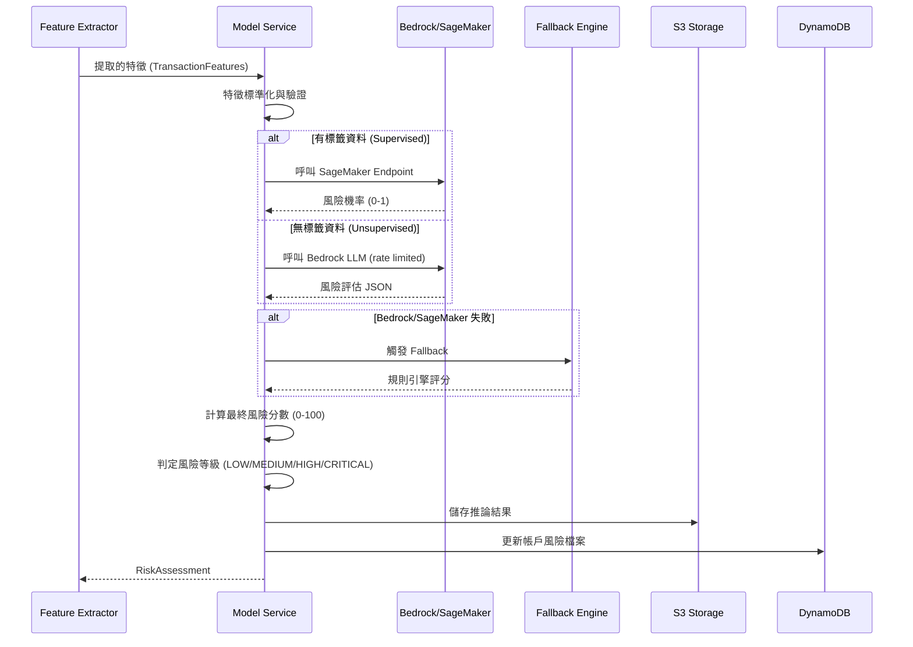
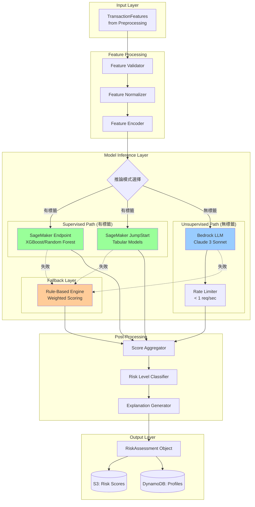
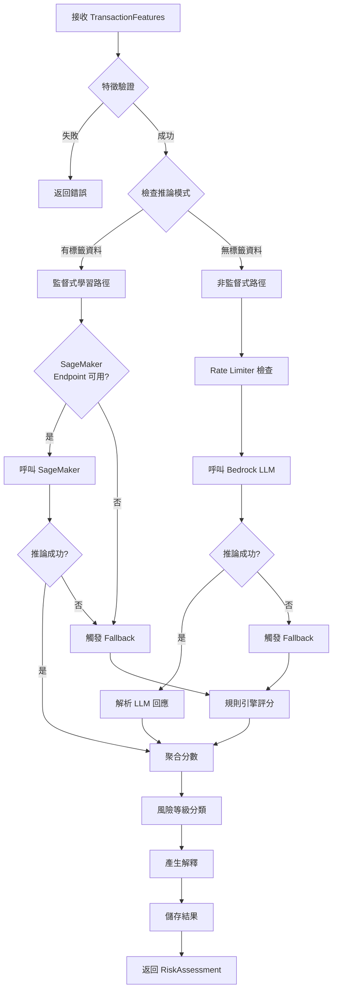

# Design Document: AWS Model Risk Scoring

## Overview

AWS 模型層與風險評分層是加密貨幣可疑帳戶偵測系統的核心推論引擎，負責將前處理後的交易特徵轉換為可操作的風險評分。本設計完全基於 AWS 原生服務（Amazon Bedrock、SageMaker JumpStart），確保符合黑客松規範，不依賴外部模型服務。系統支援有標籤與無標籤兩種場景，提供穩定的推論能力與可解釋的風險判定。

核心設計原則：
- AWS 原生優先：使用 Bedrock Foundation Models 或 SageMaker JumpStart 預訓練模型
- 穩定推論保證：實作 rate limiting、fallback 機制、錯誤處理
- 可解釋性：提供風險因子分析與自然語言解釋
- 彈性架構：支援有標籤（監督式）與無標籤（規則+LLM）兩種模式
- 成本優化：優先使用 Bedrock on-demand，避免昂貴的模型訓練

## Main Algorithm/Workflow




## Architecture

### 模型層架構圖




### 推論流程決策樹




## Components and Interfaces

### Component 1: ModelService (主推論服務)

**Purpose**: 統一的模型推論介面，協調不同推論路徑

**Interface**:
```python
from typing import Dict, Optional, Union
from enum import Enum

class InferenceMode(Enum):
    SUPERVISED = "supervised"      # 有標籤：使用 SageMaker
    UNSUPERVISED = "unsupervised"  # 無標籤：使用 Bedrock LLM
    FALLBACK = "fallback"          # 降級：使用規則引擎

class ModelService:
    def __init__(
        self,
        bedrock_client,
        sagemaker_runtime_client,
        rate_limiter: RateLimiter,
        config: ModelConfig
    ):
        """
        初始化模型服務
        
        Args:
            bedrock_client: Boto3 Bedrock client
            sagemaker_runtime_client: Boto3 SageMaker Runtime client
            rate_limiter: Rate limiter instance
            config: 模型配置
        """
        pass
    
    def infer_risk(
        self,
        features: TransactionFeatures,
        mode: Optional[InferenceMode] = None
    ) -> RiskAssessment:
        """
        執行風險推論
        
        Args:
            features: 交易特徵
            mode: 推論模式（None 則自動選擇）
            
        Returns:
            風險評估結果
            
        Raises:
            ValidationError: 特徵驗證失敗
            InferenceError: 推論失敗且 fallback 也失敗
        """
        pass
    
    def batch_infer(
        self,
        features_list: List[TransactionFeatures],
        mode: Optional[InferenceMode] = None
    ) -> List[RiskAssessment]:
        """
        批次推論（自動處理 rate limiting）
        
        Args:
            features_list: 特徵列表
            mode: 推論模式
            
        Returns:
            風險評估結果列表
        """
        pass
```

**Responsibilities**:
- 驗證輸入特徵的完整性與有效性
- 根據配置選擇推論模式（Supervised/Unsupervised/Fallback）
- 協調 Bedrock、SageMaker、Fallback 三種推論路徑
- 處理推論錯誤與重試邏輯
- 聚合多來源的風險分數
- 產生可解釋的風險評估結果


### Component 2: BedrockInferenceEngine (Bedrock 推論引擎)

**Purpose**: 使用 Amazon Bedrock Foundation Models 進行無標籤風險評估

**Interface**:
```python
class BedrockInferenceEngine:
    def __init__(
        self,
        bedrock_client,
        model_id: str = "anthropic.claude-3-sonnet-20240229-v1:0",
        rate_limiter: RateLimiter = None
    ):
        """
        初始化 Bedrock 推論引擎
        
        Args:
            bedrock_client: Boto3 Bedrock client
            model_id: Bedrock 模型 ID
            rate_limiter: Rate limiter (< 1 req/sec)
        """
        pass
    
    def infer(
        self,
        features: TransactionFeatures
    ) -> Dict[str, Union[float, str, List[str]]]:
        """
        使用 Bedrock LLM 進行風險推論
        
        Args:
            features: 交易特徵
            
        Returns:
            包含 risk_score, risk_factors, explanation, confidence 的字典
            
        Raises:
            BedrockError: Bedrock API 呼叫失敗
            RateLimitError: 超過速率限制
        """
        pass
    
    def build_prompt(
        self,
        features: TransactionFeatures
    ) -> str:
        """
        建構 Bedrock prompt
        
        Args:
            features: 交易特徵
            
        Returns:
            格式化的 prompt 字串
        """
        pass
    
    def parse_response(
        self,
        response_text: str
    ) -> Dict[str, Union[float, str, List[str]]]:
        """
        解析 LLM 回應
        
        Args:
            response_text: LLM 原始回應
            
        Returns:
            結構化的風險評估資料
            
        Raises:
            ParseError: 無法解析回應
        """
        pass
```

**Responsibilities**:
- 建構符合 Bedrock API 格式的 prompt
- 實作 rate limiting（< 1 req/sec）
- 呼叫 Bedrock InvokeModel API
- 解析 LLM JSON 回應並驗證格式
- 處理 API 錯誤與重試
- 記錄推論日誌與指標

**Bedrock Prompt Template**:
```python
BEDROCK_RISK_PROMPT = """你是一位加密貨幣反洗錢專家。請分析以下帳戶的交易特徵，評估其風險等級。

帳戶特徵：
- 總交易量: {total_volume} USD
- 交易筆數: {transaction_count}
- 平均交易金額: {avg_transaction_size} USD
- 最大交易金額: {max_transaction_size} USD
- 唯一交易對手數: {unique_counterparties}
- 深夜交易比例: {night_transaction_ratio:.1%}
- 快速連續交易數: {rapid_transaction_count}
- 整數金額比例: {round_number_ratio:.1%}
- 交易對手集中度: {concentration_score:.2f}
- 交易速度: {velocity_score:.2f} 筆/小時

請以 JSON 格式回應：
{{
  "risk_score": <0-100 的數值>,
  "risk_level": "<low|medium|high|critical>",
  "risk_factors": ["風險因子1", "風險因子2", ...],
  "explanation": "詳細的風險評估說明",
  "confidence": <0-1 的信心分數>
}}

評估標準：
- 深夜交易比例 > 30%：可能規避監控
- 整數金額比例 > 50%：可能結構化交易（洗錢特徵）
- 交易對手集中度 > 0.7：可能循環交易
- 快速連續交易 > 10 筆：可能自動化洗錢
- 交易速度 > 10 筆/小時：異常活躍
"""
```


### Component 3: SageMakerInferenceEngine (SageMaker 推論引擎)

**Purpose**: 使用 SageMaker Endpoint 或 JumpStart 模型進行有標籤風險評估

**Interface**:
```python
class SageMakerInferenceEngine:
    def __init__(
        self,
        sagemaker_runtime_client,
        endpoint_name: str,
        feature_config: FeatureConfig
    ):
        """
        初始化 SageMaker 推論引擎
        
        Args:
            sagemaker_runtime_client: Boto3 SageMaker Runtime client
            endpoint_name: SageMaker Endpoint 名稱
            feature_config: 特徵配置（欄位順序、標準化參數）
        """
        pass
    
    def infer(
        self,
        features: TransactionFeatures
    ) -> Dict[str, Union[float, List[float]]]:
        """
        使用 SageMaker Endpoint 進行推論
        
        Args:
            features: 交易特徵
            
        Returns:
            包含 risk_probability, feature_importance 的字典
            
        Raises:
            SageMakerError: Endpoint 呼叫失敗
            EndpointNotFoundError: Endpoint 不存在
        """
        pass
    
    def prepare_input(
        self,
        features: TransactionFeatures
    ) -> str:
        """
        準備 SageMaker 輸入格式（CSV 或 JSON）
        
        Args:
            features: 交易特徵
            
        Returns:
            格式化的輸入字串
        """
        pass
    
    def parse_output(
        self,
        response_body: bytes
    ) -> Dict[str, Union[float, List[float]]]:
        """
        解析 SageMaker 輸出
        
        Args:
            response_body: Endpoint 回應
            
        Returns:
            結構化的推論結果
        """
        pass
```

**Responsibilities**:
- 將 TransactionFeatures 轉換為 SageMaker 輸入格式
- 呼叫 SageMaker InvokeEndpoint API
- 解析模型輸出（機率、特徵重要性）
- 處理 Endpoint 錯誤與降級
- 支援多種模型格式（XGBoost、Random Forest、Neural Network）

**支援的 SageMaker 模型類型**:
1. **XGBoost**: 表格資料分類，輸出風險機率
2. **Random Forest**: 表格資料分類，提供特徵重要性
3. **SageMaker JumpStart Tabular Models**: 預訓練的表格分類模型
4. **AutoGluon-Tabular**: 自動化機器學習模型


### Component 4: FallbackRuleEngine (降級規則引擎)

**Purpose**: 當 Bedrock 或 SageMaker 不可用時，提供規則引擎降級方案

**Interface**:
```python
class FallbackRuleEngine:
    def __init__(self, rule_config: RuleConfig):
        """
        初始化規則引擎
        
        Args:
            rule_config: 規則配置（閾值、權重）
        """
        pass
    
    def calculate_risk_score(
        self,
        features: TransactionFeatures
    ) -> Dict[str, Union[float, List[str], str]]:
        """
        使用規則引擎計算風險分數
        
        Args:
            features: 交易特徵
            
        Returns:
            包含 risk_score, risk_factors, explanation 的字典
        """
        pass
    
    def apply_rules(
        self,
        features: TransactionFeatures
    ) -> List[Tuple[str, float, str]]:
        """
        應用所有規則並返回觸發的規則
        
        Args:
            features: 交易特徵
            
        Returns:
            List of (rule_name, score_contribution, reason)
        """
        pass
```

**Responsibilities**:
- 實作基於閾值的規則引擎
- 計算加權風險分數
- 產生規則觸發的解釋
- 提供穩定的降級方案
- 不依賴外部服務

**規則定義**:
```python
FALLBACK_RULES = [
    {
        "name": "high_volume",
        "condition": lambda f: f.total_volume > 100000,
        "score": 20,
        "reason": "總交易量超過 $100,000，屬於高風險範圍"
    },
    {
        "name": "night_transactions",
        "condition": lambda f: f.night_transaction_ratio > 0.3,
        "score": 15,
        "reason": "深夜交易比例超過 30%，可能規避監控"
    },
    {
        "name": "round_numbers",
        "condition": lambda f: f.round_number_ratio > 0.5,
        "score": 20,
        "reason": "整數金額比例超過 50%，疑似結構化交易"
    },
    {
        "name": "high_concentration",
        "condition": lambda f: f.concentration_score > 0.7,
        "score": 15,
        "reason": "交易對手集中度過高，可能循環交易"
    },
    {
        "name": "rapid_transactions",
        "condition": lambda f: f.rapid_transaction_count > 10,
        "score": 15,
        "reason": "短時間內大量交易，可能自動化洗錢"
    },
    {
        "name": "high_velocity",
        "condition": lambda f: f.velocity_score > 10,
        "score": 15,
        "reason": "交易速度超過 10 筆/小時，異常活躍"
    }
]
```


### Component 5: FeatureProcessor (特徵處理器)

**Purpose**: 驗證、標準化、編碼特徵，確保輸入品質

**Interface**:
```python
class FeatureProcessor:
    def __init__(self, scaler_params: Optional[Dict] = None):
        """
        初始化特徵處理器
        
        Args:
            scaler_params: 標準化參數（mean, std）
        """
        pass
    
    def validate(
        self,
        features: TransactionFeatures
    ) -> bool:
        """
        驗證特徵有效性
        
        Args:
            features: 交易特徵
            
        Returns:
            是否有效
            
        Raises:
            ValidationError: 驗證失敗時拋出詳細錯誤
        """
        pass
    
    def normalize(
        self,
        features: TransactionFeatures
    ) -> Dict[str, float]:
        """
        標準化數值特徵
        
        Args:
            features: 交易特徵
            
        Returns:
            標準化後的特徵字典
        """
        pass
    
    def to_vector(
        self,
        features: TransactionFeatures
    ) -> List[float]:
        """
        轉換為特徵向量（用於 SageMaker）
        
        Args:
            features: 交易特徵
            
        Returns:
            特徵向量
        """
        pass
```

**Responsibilities**:
- 驗證特徵值範圍（非負、比例在 0-1 之間）
- 標準化數值特徵（Z-score normalization）
- 處理缺失值與異常值
- 轉換為模型輸入格式
- 記錄特徵統計資訊


### Component 6: RateLimiter (速率限制器)

**Purpose**: 確保 Bedrock API 呼叫頻率 < 1 req/sec

**Interface**:
```python
import time
from threading import Lock

class RateLimiter:
    def __init__(self, max_requests_per_second: float = 0.9):
        """
        初始化速率限制器
        
        Args:
            max_requests_per_second: 最大請求頻率（< 1.0）
        """
        self.max_rps = max_requests_per_second
        self.min_interval = 1.0 / max_requests_per_second
        self.last_request_time = 0.0
        self.lock = Lock()
    
    def wait_if_needed(self) -> float:
        """
        如需要則等待以維持速率限制
        
        Returns:
            實際等待時間（秒）
        """
        with self.lock:
            current_time = time.time()
            time_since_last = current_time - self.last_request_time
            
            if time_since_last < self.min_interval:
                sleep_time = self.min_interval - time_since_last
                time.sleep(sleep_time)
                self.last_request_time = time.time()
                return sleep_time
            else:
                self.last_request_time = current_time
                return 0.0
    
    def get_current_rate(self) -> float:
        """
        取得當前請求頻率
        
        Returns:
            當前頻率（req/sec）
        """
        pass
```

**Responsibilities**:
- 追蹤最後請求時間
- 計算需要等待的時間
- 執行等待以維持速率限制
- 提供執行緒安全的速率控制
- 記錄速率限制指標


## Data Models

### Model 1: ModelConfig

```python
from dataclasses import dataclass
from typing import Optional, Dict

@dataclass
class ModelConfig:
    """模型配置"""
    
    # 推論模式
    inference_mode: InferenceMode  # SUPERVISED, UNSUPERVISED, FALLBACK
    
    # Bedrock 配置
    bedrock_model_id: str = "anthropic.claude-3-sonnet-20240229-v1:0"
    bedrock_max_tokens: int = 1024
    bedrock_temperature: float = 0.0
    
    # SageMaker 配置
    sagemaker_endpoint_name: Optional[str] = None
    sagemaker_content_type: str = "text/csv"
    sagemaker_accept: str = "application/json"
    
    # Rate Limiting
    max_requests_per_second: float = 0.9
    
    # Fallback 配置
    fallback_enabled: bool = True
    fallback_confidence: float = 0.7
    
    # 特徵標準化
    feature_scaling_enabled: bool = True
    scaler_params: Optional[Dict[str, Dict[str, float]]] = None
```

**Validation Rules**:
- `max_requests_per_second` 必須 < 1.0
- `bedrock_temperature` 必須在 0.0-1.0 之間
- `fallback_confidence` 必須在 0.0-1.0 之間
- 若 `inference_mode` 為 SUPERVISED，則 `sagemaker_endpoint_name` 不可為 None


### Model 2: InferenceResult

```python
from dataclasses import dataclass
from datetime import datetime
from typing import List, Optional, Dict

@dataclass
class InferenceResult:
    """推論結果（內部使用）"""
    
    account_id: str
    risk_score: float  # 0-100
    risk_factors: List[str]
    explanation: str
    confidence: float  # 0-1
    
    # 推論元資料
    inference_mode: InferenceMode
    model_id: Optional[str] = None  # Bedrock model ID 或 SageMaker endpoint
    inference_time_ms: float = 0.0
    fallback_used: bool = False
    
    # 特徵重要性（若可用）
    feature_importance: Optional[Dict[str, float]] = None
    
    timestamp: datetime = None
    
    def __post_init__(self):
        if self.timestamp is None:
            self.timestamp = datetime.now()
```

**Validation Rules**:
- `risk_score` 必須在 0-100 之間
- `confidence` 必須在 0-1 之間
- `risk_factors` 不可為空列表
- `explanation` 不可為空字串
- 若 `feature_importance` 存在，所有值必須在 0-1 之間且總和為 1.0


### Model 3: FeatureConfig

```python
@dataclass
class FeatureConfig:
    """特徵配置"""
    
    # 特徵欄位順序（用於 SageMaker）
    feature_names: List[str] = None
    
    # 標準化參數
    scaler_params: Dict[str, Dict[str, float]] = None
    
    # 特徵驗證規則
    validation_rules: Dict[str, Dict[str, float]] = None
    
    def __post_init__(self):
        if self.feature_names is None:
            self.feature_names = [
                "total_volume",
                "transaction_count",
                "avg_transaction_size",
                "max_transaction_size",
                "unique_counterparties",
                "night_transaction_ratio",
                "rapid_transaction_count",
                "round_number_ratio",
                "concentration_score",
                "velocity_score"
            ]
        
        if self.validation_rules is None:
            self.validation_rules = {
                "total_volume": {"min": 0, "max": float('inf')},
                "transaction_count": {"min": 1, "max": float('inf')},
                "night_transaction_ratio": {"min": 0, "max": 1},
                "round_number_ratio": {"min": 0, "max": 1},
                "concentration_score": {"min": 0, "max": 1},
                "velocity_score": {"min": 0, "max": float('inf')}
            }
```


## Algorithmic Pseudocode

### Main Processing Algorithm

```python
def infer_risk_score(
    features: TransactionFeatures,
    config: ModelConfig
) -> RiskAssessment:
    """
    主推論演算法
    
    Preconditions:
    - features 已通過驗證
    - config 包含有效的模型配置
    - AWS credentials 有效
    - 必要的 AWS 服務可存取
    
    Postconditions:
    - 返回有效的 RiskAssessment
    - risk_score 在 0-100 之間
    - risk_level 與 risk_score 一致
    - 推論結果已儲存至 S3 和 DynamoDB
    
    Loop Invariants:
    - Rate limiting 始終維持 < 1 req/sec
    - 所有推論嘗試都有記錄
    """
    
    # Step 1: 驗證與標準化特徵
    processor = FeatureProcessor(config.scaler_params)
    
    if not processor.validate(features):
        raise ValidationError("特徵驗證失敗")
    
    normalized_features = processor.normalize(features)
    assert all(isinstance(v, (int, float)) for v in normalized_features.values())
    
    # Step 2: 選擇推論模式
    inference_mode = config.inference_mode
    result = None
    fallback_used = False
    
    # Step 3: 執行推論
    try:
        if inference_mode == InferenceMode.SUPERVISED:
            # 使用 SageMaker Endpoint
            sagemaker_engine = SageMakerInferenceEngine(
                sagemaker_runtime_client,
                config.sagemaker_endpoint_name,
                FeatureConfig()
            )
            
            result = sagemaker_engine.infer(features)
            assert 0 <= result['risk_probability'] <= 1
            
            # 轉換機率為分數
            risk_score = result['risk_probability'] * 100
            
        elif inference_mode == InferenceMode.UNSUPERVISED:
            # 使用 Bedrock LLM
            rate_limiter = RateLimiter(config.max_requests_per_second)
            bedrock_engine = BedrockInferenceEngine(
                bedrock_client,
                config.bedrock_model_id,
                rate_limiter
            )
            
            # Rate limiting
            wait_time = rate_limiter.wait_if_needed()
            assert wait_time >= 0
            
            result = bedrock_engine.infer(features)
            assert 0 <= result['risk_score'] <= 100
            
            risk_score = result['risk_score']
            
        else:
            raise ValueError(f"不支援的推論模式: {inference_mode}")
            
    except Exception as e:
        # Step 4: Fallback 處理
        if config.fallback_enabled:
            fallback_engine = FallbackRuleEngine(RuleConfig())
            result = fallback_engine.calculate_risk_score(features)
            risk_score = result['risk_score']
            fallback_used = True
        else:
            raise InferenceError(f"推論失敗且 fallback 未啟用: {e}")
    
    # Step 5: 分類風險等級
    risk_level = classify_risk_level(risk_score)
    assert risk_level in [RiskLevel.LOW, RiskLevel.MEDIUM, RiskLevel.HIGH, RiskLevel.CRITICAL]
    
    # Step 6: 建立 RiskAssessment
    assessment = RiskAssessment(
        account_id=features.account_id,
        risk_score=risk_score,
        risk_level=risk_level,
        risk_factors=result.get('risk_factors', []),
        explanation=result.get('explanation', ''),
        confidence=result.get('confidence', config.fallback_confidence if fallback_used else 0.9),
        timestamp=datetime.now()
    )
    
    # Step 7: 儲存結果
    store_to_s3(assessment, "risk-scores-bucket")
    store_to_dynamodb(assessment, "risk-profiles-table")
    
    return assessment
```


### Bedrock Inference Algorithm

```python
def bedrock_infer(
    features: TransactionFeatures,
    bedrock_client,
    model_id: str,
    rate_limiter: RateLimiter
) -> Dict[str, Union[float, str, List[str]]]:
    """
    使用 Bedrock LLM 進行推論
    
    Preconditions:
    - features 已驗證
    - bedrock_client 已初始化
    - rate_limiter 確保 < 1 req/sec
    - model_id 為有效的 Bedrock 模型
    
    Postconditions:
    - 返回包含 risk_score, risk_factors, explanation, confidence 的字典
    - risk_score 在 0-100 之間
    - confidence 在 0-1 之間
    - rate limiting 已維持
    
    Loop Invariants:
    - 每次 API 呼叫前都執行 rate limiting
    """
    
    # Step 1: Rate limiting
    wait_time = rate_limiter.wait_if_needed()
    assert wait_time >= 0
    
    # Step 2: 建構 prompt
    prompt = build_bedrock_prompt(features)
    assert len(prompt) > 0
    
    # Step 3: 呼叫 Bedrock API
    request_body = {
        "anthropic_version": "bedrock-2023-05-31",
        "max_tokens": 1024,
        "temperature": 0.0,
        "messages": [
            {
                "role": "user",
                "content": prompt
            }
        ]
    }
    
    try:
        response = bedrock_client.invoke_model(
            modelId=model_id,
            body=json.dumps(request_body)
        )
        
        response_body = json.loads(response['body'].read())
        llm_output = response_body['content'][0]['text']
        
    except Exception as e:
        raise BedrockError(f"Bedrock API 呼叫失敗: {e}")
    
    # Step 4: 解析 LLM 回應
    try:
        # 提取 JSON 部分
        json_start = llm_output.find('{')
        json_end = llm_output.rfind('}') + 1
        json_str = llm_output[json_start:json_end]
        
        result = json.loads(json_str)
        
        # 驗證必要欄位
        assert 'risk_score' in result
        assert 'risk_level' in result
        assert 'risk_factors' in result
        assert 'explanation' in result
        assert 'confidence' in result
        
        # 驗證值範圍
        assert 0 <= result['risk_score'] <= 100
        assert 0 <= result['confidence'] <= 1
        assert result['risk_level'] in ['low', 'medium', 'high', 'critical']
        
        return result
        
    except Exception as e:
        raise ParseError(f"無法解析 LLM 回應: {e}")


def build_bedrock_prompt(features: TransactionFeatures) -> str:
    """
    建構 Bedrock prompt
    
    Preconditions:
    - features 包含所有必要欄位
    
    Postconditions:
    - 返回格式化的 prompt 字串
    - prompt 包含所有特徵值
    """
    
    prompt = f"""你是一位加密貨幣反洗錢專家。請分析以下帳戶的交易特徵，評估其風險等級。

帳戶特徵：
- 總交易量: ${features.total_volume:,.2f} USD
- 交易筆數: {features.transaction_count}
- 平均交易金額: ${features.avg_transaction_size:,.2f} USD
- 最大交易金額: ${features.max_transaction_size:,.2f} USD
- 唯一交易對手數: {features.unique_counterparties}
- 深夜交易比例: {features.night_transaction_ratio:.1%}
- 快速連續交易數: {features.rapid_transaction_count}
- 整數金額比例: {features.round_number_ratio:.1%}
- 交易對手集中度: {features.concentration_score:.2f}
- 交易速度: {features.velocity_score:.2f} 筆/小時

請以 JSON 格式回應：
{{
  "risk_score": <0-100 的數值>,
  "risk_level": "<low|medium|high|critical>",
  "risk_factors": ["風險因子1", "風險因子2", ...],
  "explanation": "詳細的風險評估說明",
  "confidence": <0-1 的信心分數>
}}

評估標準：
- 深夜交易比例 > 30%：可能規避監控
- 整數金額比例 > 50%：可能結構化交易（洗錢特徵）
- 交易對手集中度 > 0.7：可能循環交易
- 快速連續交易 > 10 筆：可能自動化洗錢
- 交易速度 > 10 筆/小時：異常活躍
"""
    
    return prompt
```


### SageMaker Inference Algorithm

```python
def sagemaker_infer(
    features: TransactionFeatures,
    sagemaker_runtime_client,
    endpoint_name: str,
    feature_config: FeatureConfig
) -> Dict[str, Union[float, List[float]]]:
    """
    使用 SageMaker Endpoint 進行推論
    
    Preconditions:
    - features 已驗證
    - sagemaker_runtime_client 已初始化
    - endpoint_name 對應的 Endpoint 存在且 InService
    - feature_config 包含正確的特徵順序
    
    Postconditions:
    - 返回包含 risk_probability 的字典
    - risk_probability 在 0-1 之間
    - 若模型支援，返回 feature_importance
    
    Loop Invariants: N/A (單次呼叫)
    """
    
    # Step 1: 準備輸入
    feature_vector = prepare_sagemaker_input(features, feature_config)
    assert len(feature_vector) == len(feature_config.feature_names)
    
    # 轉換為 CSV 格式
    csv_input = ','.join(str(v) for v in feature_vector)
    
    # Step 2: 呼叫 SageMaker Endpoint
    try:
        response = sagemaker_runtime_client.invoke_endpoint(
            EndpointName=endpoint_name,
            ContentType='text/csv',
            Accept='application/json',
            Body=csv_input
        )
        
        response_body = response['Body'].read().decode('utf-8')
        
    except Exception as e:
        raise SageMakerError(f"SageMaker Endpoint 呼叫失敗: {e}")
    
    # Step 3: 解析輸出
    try:
        result = json.loads(response_body)
        
        # 不同模型格式處理
        if 'predictions' in result:
            # XGBoost / Random Forest 格式
            risk_probability = result['predictions'][0]
        elif 'score' in result:
            # 通用分類格式
            risk_probability = result['score']
        else:
            raise ParseError(f"未知的 SageMaker 輸出格式: {result}")
        
        assert 0 <= risk_probability <= 1
        
        # 提取特徵重要性（若可用）
        feature_importance = None
        if 'feature_importance' in result:
            feature_importance = result['feature_importance']
        
        return {
            'risk_probability': risk_probability,
            'feature_importance': feature_importance
        }
        
    except Exception as e:
        raise ParseError(f"無法解析 SageMaker 輸出: {e}")


def prepare_sagemaker_input(
    features: TransactionFeatures,
    feature_config: FeatureConfig
) -> List[float]:
    """
    準備 SageMaker 輸入向量
    
    Preconditions:
    - features 包含所有必要欄位
    - feature_config.feature_names 定義特徵順序
    
    Postconditions:
    - 返回特徵向量
    - 向量長度等於 feature_names 長度
    - 所有值為數值型態
    """
    
    feature_dict = {
        'total_volume': features.total_volume,
        'transaction_count': features.transaction_count,
        'avg_transaction_size': features.avg_transaction_size,
        'max_transaction_size': features.max_transaction_size,
        'unique_counterparties': features.unique_counterparties,
        'night_transaction_ratio': features.night_transaction_ratio,
        'rapid_transaction_count': features.rapid_transaction_count,
        'round_number_ratio': features.round_number_ratio,
        'concentration_score': features.concentration_score,
        'velocity_score': features.velocity_score
    }
    
    # 按照配置的順序建立向量
    feature_vector = []
    for name in feature_config.feature_names:
        if name not in feature_dict:
            raise ValueError(f"特徵 {name} 不存在於 features 中")
        feature_vector.append(feature_dict[name])
    
    assert len(feature_vector) == len(feature_config.feature_names)
    return feature_vector
```


### Fallback Rule Engine Algorithm

```python
def fallback_calculate_risk_score(
    features: TransactionFeatures,
    rule_config: RuleConfig
) -> Dict[str, Union[float, List[str], str]]:
    """
    使用規則引擎計算風險分數
    
    Preconditions:
    - features 已驗證
    - rule_config 包含有效的規則定義
    
    Postconditions:
    - 返回包含 risk_score, risk_factors, explanation 的字典
    - risk_score 在 0-100 之間
    - risk_factors 包含所有觸發的規則
    
    Loop Invariants:
    - 累積的 risk_score 不超過 100
    - 所有觸發的規則都被記錄
    """
    
    risk_score = 0.0
    risk_factors = []
    triggered_rules = []
    
    # 定義規則
    rules = [
        {
            "name": "high_volume",
            "condition": features.total_volume > 100000,
            "score": 20,
            "reason": f"總交易量 ${features.total_volume:,.2f} 超過 $100,000"
        },
        {
            "name": "night_transactions",
            "condition": features.night_transaction_ratio > 0.3,
            "score": 15,
            "reason": f"深夜交易比例 {features.night_transaction_ratio:.1%} 超過 30%"
        },
        {
            "name": "round_numbers",
            "condition": features.round_number_ratio > 0.5,
            "score": 20,
            "reason": f"整數金額比例 {features.round_number_ratio:.1%} 超過 50%"
        },
        {
            "name": "high_concentration",
            "condition": features.concentration_score > 0.7,
            "score": 15,
            "reason": f"交易對手集中度 {features.concentration_score:.2f} 超過 0.7"
        },
        {
            "name": "rapid_transactions",
            "condition": features.rapid_transaction_count > 10,
            "score": 15,
            "reason": f"快速連續交易 {features.rapid_transaction_count} 筆超過 10 筆"
        },
        {
            "name": "high_velocity",
            "condition": features.velocity_score > 10,
            "score": 15,
            "reason": f"交易速度 {features.velocity_score:.2f} 筆/小時超過 10"
        }
    ]
    
    # 應用所有規則
    for rule in rules:
        # Loop invariant: risk_score <= 100
        assert risk_score <= 100
        
        if rule["condition"]:
            risk_score += rule["score"]
            risk_factors.append(rule["reason"])
            triggered_rules.append(rule["name"])
    
    # 限制最大分數為 100
    risk_score = min(risk_score, 100)
    
    # 產生解釋
    if len(triggered_rules) == 0:
        explanation = "未觸發任何風險規則，帳戶行為正常。"
    else:
        explanation = f"觸發 {len(triggered_rules)} 個風險規則：{', '.join(triggered_rules)}。"
    
    return {
        'risk_score': risk_score,
        'risk_factors': risk_factors,
        'explanation': explanation,
        'confidence': 0.7  # 規則引擎信心度較低
    }
```


### Risk Level Classification Algorithm

```python
def classify_risk_level(risk_score: float) -> RiskLevel:
    """
    根據風險分數分類風險等級
    
    Preconditions:
    - risk_score 在 0-100 之間
    
    Postconditions:
    - 返回對應的 RiskLevel
    - 分類邏輯一致且確定性
    
    Loop Invariants: N/A (單次判斷)
    """
    
    assert 0 <= risk_score <= 100, f"risk_score 必須在 0-100 之間，得到 {risk_score}"
    
    if risk_score >= 76:
        return RiskLevel.CRITICAL
    elif risk_score >= 51:
        return RiskLevel.HIGH
    elif risk_score >= 26:
        return RiskLevel.MEDIUM
    else:
        return RiskLevel.LOW
```


## Key Functions with Formal Specifications

### Function 1: ModelService.infer_risk()

```python
def infer_risk(
    self,
    features: TransactionFeatures,
    mode: Optional[InferenceMode] = None
) -> RiskAssessment:
    """
    執行風險推論
    """
    pass
```

**Preconditions:**
- `features` 是有效的 TransactionFeatures 物件
- `features.account_id` 非空
- 所有數值特徵非負
- 比例特徵（night_transaction_ratio, round_number_ratio, concentration_score）在 0-1 之間
- AWS credentials 有效且有權限存取 Bedrock/SageMaker
- 若 `mode` 為 SUPERVISED，則 SageMaker Endpoint 必須存在

**Postconditions:**
- 返回有效的 RiskAssessment 物件
- `risk_score` 在 0-100 之間
- `risk_level` 與 `risk_score` 範圍一致
- `confidence` 在 0-1 之間
- 推論結果已儲存至 S3 和 DynamoDB
- 若使用 Bedrock，rate limiting 已維持 < 1 req/sec

**Loop Invariants:** N/A (單次推論)

### Function 2: BedrockInferenceEngine.infer()

```python
def infer(
    self,
    features: TransactionFeatures
) -> Dict[str, Union[float, str, List[str]]]:
    """
    使用 Bedrock LLM 進行風險推論
    """
    pass
```

**Preconditions:**
- `features` 已通過驗證
- Bedrock client 已初始化
- Rate limiter 已配置且 max_rps < 1.0
- Bedrock 模型 ID 有效且可存取

**Postconditions:**
- 返回包含 risk_score, risk_level, risk_factors, explanation, confidence 的字典
- `risk_score` 在 0-100 之間
- `confidence` 在 0-1 之間
- `risk_level` 為 "low", "medium", "high", "critical" 之一
- `risk_factors` 為非空列表
- Rate limiting 已執行，實際請求間隔 >= 1.0 秒

**Loop Invariants:** 
- 每次 API 呼叫前都執行 rate limiting
- 累積的 API 呼叫頻率 < 1 req/sec


### Function 3: SageMakerInferenceEngine.infer()

```python
def infer(
    self,
    features: TransactionFeatures
) -> Dict[str, Union[float, List[float]]]:
    """
    使用 SageMaker Endpoint 進行推論
    """
    pass
```

**Preconditions:**
- `features` 已通過驗證
- SageMaker Runtime client 已初始化
- Endpoint 名稱有效且 Endpoint 狀態為 InService
- Feature config 包含正確的特徵順序與標準化參數

**Postconditions:**
- 返回包含 risk_probability 的字典
- `risk_probability` 在 0-1 之間
- 若模型支援，返回 feature_importance（總和為 1.0）
- 推論時間已記錄

**Loop Invariants:** N/A (單次 API 呼叫)

### Function 4: FallbackRuleEngine.calculate_risk_score()

```python
def calculate_risk_score(
    self,
    features: TransactionFeatures
) -> Dict[str, Union[float, List[str], str]]:
    """
    使用規則引擎計算風險分數
    """
    pass
```

**Preconditions:**
- `features` 已通過驗證
- Rule config 包含有效的規則定義與閾值

**Postconditions:**
- 返回包含 risk_score, risk_factors, explanation 的字典
- `risk_score` 在 0-100 之間
- `risk_factors` 包含所有觸發的規則描述
- `explanation` 為非空字串
- 不依賴任何外部服務

**Loop Invariants:**
- 遍歷規則時，累積的 risk_score <= 100
- 所有觸發的規則都被記錄在 risk_factors 中


### Function 5: FeatureProcessor.validate()

```python
def validate(
    self,
    features: TransactionFeatures
) -> bool:
    """
    驗證特徵有效性
    """
    pass
```

**Preconditions:**
- `features` 是 TransactionFeatures 物件

**Postconditions:**
- 返回 True 若所有驗證通過
- 拋出 ValidationError 若驗證失敗，包含詳細錯誤訊息
- 驗證規則包括：
  - account_id 非空
  - total_volume >= 0
  - transaction_count > 0
  - avg_transaction_size >= 0
  - max_transaction_size >= 0
  - unique_counterparties >= 0
  - 0 <= night_transaction_ratio <= 1
  - rapid_transaction_count >= 0
  - 0 <= round_number_ratio <= 1
  - 0 <= concentration_score <= 1
  - velocity_score >= 0

**Loop Invariants:**
- 遍歷驗證規則時，所有已檢查的欄位都符合規則

### Function 6: RateLimiter.wait_if_needed()

```python
def wait_if_needed(self) -> float:
    """
    如需要則等待以維持速率限制
    """
    pass
```

**Preconditions:**
- RateLimiter 已初始化
- max_requests_per_second < 1.0

**Postconditions:**
- 返回實際等待時間（秒）
- 確保距離上次請求至少經過 min_interval 秒
- 更新 last_request_time 為當前時間
- 執行緒安全（使用 lock）

**Loop Invariants:** N/A (單次呼叫)


## Example Usage

### Example 1: 無標籤資料使用 Bedrock

```python
import boto3
from models import TransactionFeatures
from model_service import ModelService, ModelConfig, InferenceMode
from rate_limiter import RateLimiter

# 初始化 AWS clients
bedrock_client = boto3.client('bedrock-runtime', region_name='us-east-1')
sagemaker_client = boto3.client('sagemaker-runtime', region_name='us-east-1')

# 配置模型服務（無標籤模式）
config = ModelConfig(
    inference_mode=InferenceMode.UNSUPERVISED,
    bedrock_model_id="anthropic.claude-3-sonnet-20240229-v1:0",
    max_requests_per_second=0.9,
    fallback_enabled=True
)

# 初始化服務
rate_limiter = RateLimiter(max_requests_per_second=0.9)
model_service = ModelService(
    bedrock_client=bedrock_client,
    sagemaker_runtime_client=sagemaker_client,
    rate_limiter=rate_limiter,
    config=config
)

# 準備特徵
features = TransactionFeatures(
    account_id="account_12345",
    total_volume=150000.0,
    transaction_count=50,
    avg_transaction_size=3000.0,
    max_transaction_size=25000.0,
    unique_counterparties=5,
    night_transaction_ratio=0.4,
    rapid_transaction_count=15,
    round_number_ratio=0.6,
    concentration_score=0.8,
    velocity_score=12.5
)

# 執行推論
assessment = model_service.infer_risk(features)

print(f"帳戶: {assessment.account_id}")
print(f"風險分數: {assessment.risk_score}")
print(f"風險等級: {assessment.risk_level.value}")
print(f"風險因子: {', '.join(assessment.risk_factors)}")
print(f"解釋: {assessment.explanation}")
print(f"信心度: {assessment.confidence}")
```


### Example 2: 有標籤資料使用 SageMaker

```python
# 配置模型服務（有標籤模式）
config = ModelConfig(
    inference_mode=InferenceMode.SUPERVISED,
    sagemaker_endpoint_name="fraud-detection-xgboost-endpoint",
    sagemaker_content_type="text/csv",
    fallback_enabled=True
)

model_service = ModelService(
    bedrock_client=bedrock_client,
    sagemaker_runtime_client=sagemaker_client,
    rate_limiter=rate_limiter,
    config=config
)

# 執行推論
assessment = model_service.infer_risk(features)

print(f"風險分數: {assessment.risk_score}")
print(f"風險等級: {assessment.risk_level.value}")

# 若模型提供特徵重要性
if hasattr(assessment, 'feature_importance'):
    print("特徵重要性:")
    for feature, importance in assessment.feature_importance.items():
        print(f"  {feature}: {importance:.3f}")
```

### Example 3: 批次推論

```python
# 準備多個帳戶的特徵
features_list = [
    TransactionFeatures(account_id="account_001", ...),
    TransactionFeatures(account_id="account_002", ...),
    TransactionFeatures(account_id="account_003", ...),
]

# 批次推論（自動處理 rate limiting）
assessments = model_service.batch_infer(features_list)

# 處理結果
for assessment in assessments:
    if assessment.risk_level in [RiskLevel.HIGH, RiskLevel.CRITICAL]:
        print(f"高風險帳戶: {assessment.account_id}")
        print(f"  分數: {assessment.risk_score}")
        print(f"  原因: {assessment.explanation}")
```


### Example 4: Fallback 降級處理

```python
# 配置僅使用 Fallback（測試或 Bedrock 不可用時）
config = ModelConfig(
    inference_mode=InferenceMode.FALLBACK,
    fallback_enabled=True
)

model_service = ModelService(
    bedrock_client=None,
    sagemaker_runtime_client=None,
    rate_limiter=None,
    config=config
)

# 執行推論（使用規則引擎）
assessment = model_service.infer_risk(features)

print(f"風險分數: {assessment.risk_score}")
print(f"信心度: {assessment.confidence}")  # 較低，約 0.7
print(f"推論模式: Fallback (規則引擎)")
```

### Example 5: 錯誤處理

```python
from exceptions import ValidationError, InferenceError, BedrockError

try:
    # 嘗試推論
    assessment = model_service.infer_risk(features)
    
except ValidationError as e:
    print(f"特徵驗證失敗: {e}")
    # 記錄錯誤並通知資料團隊
    
except BedrockError as e:
    print(f"Bedrock API 失敗: {e}")
    # 自動降級至 Fallback
    config.inference_mode = InferenceMode.FALLBACK
    assessment = model_service.infer_risk(features)
    
except InferenceError as e:
    print(f"推論失敗: {e}")
    # 記錄錯誤並返回預設低風險評估
    assessment = create_default_assessment(features.account_id)
```


## Correctness Properties

### Property 1: 風險分數範圍保證

**Universal Quantification:**
```
∀ features ∈ TransactionFeatures, ∀ mode ∈ InferenceMode:
  LET assessment = infer_risk(features, mode)
  THEN 0 ≤ assessment.risk_score ≤ 100
```

**說明:** 無論使用何種推論模式（Bedrock、SageMaker、Fallback），返回的風險分數必定在 0-100 之間。

### Property 2: 風險等級一致性

**Universal Quantification:**
```
∀ assessment ∈ RiskAssessment:
  (assessment.risk_score ∈ [0, 25] ⟹ assessment.risk_level = LOW) ∧
  (assessment.risk_score ∈ [26, 50] ⟹ assessment.risk_level = MEDIUM) ∧
  (assessment.risk_score ∈ [51, 75] ⟹ assessment.risk_level = HIGH) ∧
  (assessment.risk_score ∈ [76, 100] ⟹ assessment.risk_level = CRITICAL)
```

**說明:** 風險等級必定與風險分數範圍一致，不存在不匹配的情況。

### Property 3: Rate Limiting 保證

**Universal Quantification:**
```
∀ t1, t2 ∈ BedrockAPICall:
  t2.timestamp > t1.timestamp ⟹ (t2.timestamp - t1.timestamp) ≥ 1.0 秒
```

**說明:** 任意兩次連續的 Bedrock API 呼叫之間，時間間隔必定 >= 1.0 秒。

### Property 4: 特徵驗證完整性

**Universal Quantification:**
```
∀ features ∈ TransactionFeatures:
  validate(features) = true ⟹
    (features.account_id ≠ "" ∧
     features.total_volume ≥ 0 ∧
     features.transaction_count > 0 ∧
     0 ≤ features.night_transaction_ratio ≤ 1 ∧
     0 ≤ features.round_number_ratio ≤ 1 ∧
     0 ≤ features.concentration_score ≤ 1)
```

**說明:** 通過驗證的特徵必定滿足所有數值範圍約束。


### Property 5: Fallback 可用性

**Universal Quantification:**
```
∀ features ∈ TransactionFeatures:
  (BedrockUnavailable ∨ SageMakerUnavailable) ∧ fallback_enabled = true ⟹
    ∃ assessment ∈ RiskAssessment: assessment = fallback_calculate_risk_score(features)
```

**說明:** 當 Bedrock 或 SageMaker 不可用且 fallback 啟用時，系統必定能透過規則引擎產生風險評估。

### Property 6: 信心度範圍

**Universal Quantification:**
```
∀ assessment ∈ RiskAssessment:
  0 ≤ assessment.confidence ≤ 1
```

**說明:** 信心度必定在 0-1 之間。

### Property 7: 非空解釋

**Universal Quantification:**
```
∀ assessment ∈ RiskAssessment:
  assessment.explanation ≠ "" ∧ len(assessment.risk_factors) > 0
```

**說明:** 每個風險評估必定包含非空的解釋與至少一個風險因子。

### Property 8: 批次推論順序保證

**Universal Quantification:**
```
∀ features_list ∈ List[TransactionFeatures]:
  LET assessments = batch_infer(features_list)
  THEN len(assessments) = len(features_list) ∧
       ∀ i ∈ [0, len(features_list)):
         assessments[i].account_id = features_list[i].account_id
```

**說明:** 批次推論返回的評估列表長度與輸入相同，且順序一致。


## Error Handling

### Error Scenario 1: Bedrock API 失敗

**Condition**: Bedrock InvokeModel API 返回錯誤或超時

**Response**: 
1. 記錄錯誤詳情至 CloudWatch
2. 若 retry 次數 < 2，執行指數退避重試
3. 若重試失敗且 fallback_enabled = true，切換至 Fallback 規則引擎
4. 若 fallback 未啟用，拋出 InferenceError

**Recovery**: 使用 Fallback 規則引擎產生風險評估，標記 fallback_used = true，confidence 降至 0.7

### Error Scenario 2: SageMaker Endpoint 不存在或 OutOfService

**Condition**: SageMaker InvokeEndpoint 返回 EndpointNotFound 或 Endpoint 狀態非 InService

**Response**:
1. 記錄錯誤至 CloudWatch
2. 檢查 Endpoint 狀態
3. 若 fallback_enabled = true，切換至 Fallback 規則引擎
4. 若 fallback 未啟用，拋出 SageMakerError

**Recovery**: 使用 Fallback 規則引擎，通知運維團隊檢查 Endpoint 狀態

### Error Scenario 3: 特徵驗證失敗

**Condition**: TransactionFeatures 包含無效值（負數、超出範圍等）

**Response**:
1. 拋出 ValidationError，包含詳細的驗證失敗原因
2. 記錄驗證錯誤至 CloudWatch
3. 不執行推論

**Recovery**: 返回錯誤給上游服務，要求修正特徵資料


### Error Scenario 4: Rate Limit 超標

**Condition**: 請求頻率超過 1 req/sec（不應發生，但作為防護）

**Response**:
1. RateLimiter 自動等待至滿足間隔要求
2. 記錄等待時間至 CloudWatch
3. 若等待時間過長（> 5 秒），記錄警告

**Recovery**: 自動恢復，無需人工介入

### Error Scenario 5: LLM 回應格式錯誤

**Condition**: Bedrock 返回的 JSON 無法解析或缺少必要欄位

**Response**:
1. 記錄原始回應至 CloudWatch（用於除錯）
2. 拋出 ParseError
3. 若 fallback_enabled = true，切換至 Fallback 規則引擎

**Recovery**: 使用 Fallback 規則引擎，通知 AI 團隊檢查 prompt 設計

### Error Scenario 6: S3 或 DynamoDB 寫入失敗

**Condition**: 儲存推論結果至 S3 或 DynamoDB 失敗

**Response**:
1. 記錄錯誤至 CloudWatch
2. 重試最多 3 次（指數退避）
3. 若仍失敗，記錄嚴重錯誤但不影響推論結果返回

**Recovery**: 推論結果仍返回給呼叫者，但標記儲存失敗，觸發告警


## Testing Strategy

### Unit Testing Approach

**測試範圍:**
- 每個 Component 的獨立功能
- 特徵驗證邏輯
- 風險分數計算
- 風險等級分類
- Rate limiter 行為

**關鍵測試案例:**
1. `test_feature_validation_valid_input`: 驗證有效特徵通過驗證
2. `test_feature_validation_invalid_ratio`: 驗證比例超出 0-1 範圍時拋出錯誤
3. `test_risk_level_classification`: 驗證所有分數範圍正確分類
4. `test_fallback_rule_engine`: 驗證規則引擎計算正確
5. `test_rate_limiter_wait`: 驗證 rate limiter 正確等待

**測試工具:** pytest, unittest.mock

### Property-Based Testing Approach

**Property Test Library**: Hypothesis (Python)

**測試屬性:**

1. **風險分數範圍屬性**
```python
@given(features=transaction_features_strategy())
def test_risk_score_always_in_range(features):
    assessment = model_service.infer_risk(features, mode=InferenceMode.FALLBACK)
    assert 0 <= assessment.risk_score <= 100
```

2. **風險等級一致性屬性**
```python
@given(risk_score=st.floats(min_value=0, max_value=100))
def test_risk_level_matches_score(risk_score):
    level = classify_risk_level(risk_score)
    if risk_score >= 76:
        assert level == RiskLevel.CRITICAL
    elif risk_score >= 51:
        assert level == RiskLevel.HIGH
    elif risk_score >= 26:
        assert level == RiskLevel.MEDIUM
    else:
        assert level == RiskLevel.LOW
```

3. **特徵驗證屬性**
```python
@given(features=transaction_features_strategy())
def test_validated_features_satisfy_constraints(features):
    processor = FeatureProcessor()
    if processor.validate(features):
        assert features.total_volume >= 0
        assert features.transaction_count > 0
        assert 0 <= features.night_transaction_ratio <= 1
        assert 0 <= features.concentration_score <= 1
```

4. **Rate Limiting 屬性**
```python
@given(num_requests=st.integers(min_value=2, max_value=10))
def test_rate_limiter_maintains_interval(num_requests):
    rate_limiter = RateLimiter(max_requests_per_second=0.9)
    timestamps = []
    
    for _ in range(num_requests):
        rate_limiter.wait_if_needed()
        timestamps.append(time.time())
    
    # 檢查所有連續請求間隔 >= 1.0 秒
    for i in range(1, len(timestamps)):
        assert timestamps[i] - timestamps[i-1] >= 1.0
```


### Integration Testing Approach

**測試範圍:**
- 端到端推論流程
- AWS 服務整合（Bedrock、SageMaker、S3、DynamoDB）
- Fallback 降級機制
- 批次推論

**關鍵測試案例:**
1. `test_bedrock_inference_e2e`: 使用真實 Bedrock API 進行推論
2. `test_sagemaker_inference_e2e`: 使用真實 SageMaker Endpoint 進行推論
3. `test_fallback_on_bedrock_failure`: 模擬 Bedrock 失敗，驗證 fallback 啟動
4. `test_batch_inference_rate_limiting`: 驗證批次推論維持 rate limiting
5. `test_s3_dynamodb_storage`: 驗證推論結果正確儲存

**測試環境:** 使用 AWS 測試帳號，部署測試用 SageMaker Endpoint

**Mock 策略:**
- 使用 moto 模擬 S3 和 DynamoDB
- 使用 responses 模擬 Bedrock API（單元測試）
- 整合測試使用真實 AWS 服務


## Performance Considerations

### 推論延遲

**目標:**
- Bedrock 推論: < 3 秒/帳戶（包含 rate limiting）
- SageMaker 推論: < 500 ms/帳戶
- Fallback 推論: < 50 ms/帳戶

**優化策略:**
1. 使用 Bedrock on-demand 模式，避免 provisioned throughput 成本
2. SageMaker Endpoint 使用 ml.m5.large 或更大實例
3. 批次推論時並行處理（SageMaker），序列處理（Bedrock with rate limiting）
4. 快取常用的 scaler_params 和 feature_config

### 吞吐量

**目標:**
- Bedrock: 最多 0.9 req/sec（受限於規範）
- SageMaker: 最多 100 req/sec（取決於 Endpoint 配置）
- Fallback: 無限制（純計算）

**擴展策略:**
1. 若需更高吞吐量，部署多個 SageMaker Endpoint 並使用 load balancing
2. 使用 SageMaker Batch Transform 進行大規模批次推論
3. 考慮使用 SageMaker Serverless Inference 降低成本

### 成本優化

**估算（每 1000 次推論）:**
- Bedrock Claude 3 Sonnet: ~$5-10（取決於 prompt 長度）
- SageMaker Endpoint (ml.m5.large): ~$0.10/小時 × 運行時間
- Fallback: $0（純計算）

**優化建議:**
1. 優先使用 Fallback 處理明顯的低風險/高風險案例
2. 僅對中等風險案例使用 Bedrock/SageMaker
3. 使用 SageMaker Serverless Inference 降低閒置成本
4. 定期檢視 Bedrock 使用量，考慮 provisioned throughput（若量大）


## Security Considerations

### 資料安全

**威脅模型:**
- 交易特徵包含敏感的帳戶行為資訊
- 風險評估結果可能影響帳戶凍結決策
- Bedrock prompt 可能包含敏感資料

**緩解策略:**
1. 所有 S3 bucket 設定為私有，啟用加密（AES-256）
2. DynamoDB 啟用 encryption at rest
3. 不在 CloudWatch Logs 記錄帳戶 ID 或交易金額
4. 使用 IAM 最小權限原則
5. Bedrock prompt 不包含真實帳戶 ID，使用匿名化 ID

### API 安全

**威脅模型:**
- 未授權存取 Bedrock/SageMaker API
- API Key 洩漏
- Rate limiting 繞過

**緩解策略:**
1. 使用 IAM Role 而非 API Key 存取 AWS 服務
2. 所有 Lambda 函數使用最小權限 IAM Role
3. Rate Limiter 實作執行緒安全的速率控制
4. 使用 AWS Secrets Manager 管理任何第三方 API Key
5. 啟用 CloudTrail 記錄所有 API 呼叫

### 模型安全

**威脅模型:**
- Prompt injection 攻擊
- 模型輸出操縱
- 訓練資料投毒（若使用 SageMaker 訓練）

**緩解策略:**
1. Bedrock prompt 使用固定模板，不接受使用者輸入
2. 驗證 LLM 輸出格式與值範圍
3. 使用 Fallback 規則引擎作為安全網
4. SageMaker 模型訓練使用隔離的訓練資料集
5. 定期審查模型輸出品質


## Dependencies

### AWS 服務依賴

1. **Amazon Bedrock**
   - 用途: 無標籤風險評估（LLM 推論）
   - 模型: Claude 3 Sonnet (anthropic.claude-3-sonnet-20240229-v1:0)
   - 區域: us-east-1 或 us-west-2
   - 權限: bedrock:InvokeModel

2. **Amazon SageMaker**
   - 用途: 有標籤風險評估（監督式學習）
   - Endpoint: 自訂部署的 XGBoost/Random Forest 模型
   - 權限: sagemaker:InvokeEndpoint

3. **Amazon S3**
   - 用途: 儲存推論結果、模型配置
   - Bucket: risk-scores-bucket, model-config-bucket
   - 權限: s3:GetObject, s3:PutObject

4. **Amazon DynamoDB**
   - 用途: 儲存帳戶風險檔案
   - Table: risk-profiles-table
   - 權限: dynamodb:PutItem, dynamodb:GetItem, dynamodb:Query

5. **AWS CloudWatch**
   - 用途: 日誌與指標
   - 權限: logs:CreateLogGroup, logs:CreateLogStream, logs:PutLogEvents

### Python 套件依賴

```
boto3>=1.28.0          # AWS SDK
botocore>=1.31.0       # AWS SDK core
pydantic>=2.0.0        # 資料驗證
python-dateutil>=2.8.0 # 日期處理
```

### 可選依賴（用於測試）

```
pytest>=7.4.0          # 測試框架
hypothesis>=6.82.0     # Property-based testing
moto>=4.1.0            # AWS 服務 mock
responses>=0.23.0      # HTTP mock
```


## 最小可行方案 (MVP)

### MVP 範圍

為了在黑客松 4 小時內完成，建議以下最小可行方案：

**包含功能:**
1. ✅ Bedrock LLM 推論（無標籤模式）
2. ✅ Fallback 規則引擎
3. ✅ Rate Limiter (< 1 req/sec)
4. ✅ 特徵驗證
5. ✅ 風險等級分類
6. ✅ S3 儲存推論結果
7. ✅ CloudWatch 日誌

**暫時跳過:**
1. ❌ SageMaker Endpoint（需要訓練模型，耗時）
2. ❌ DynamoDB 儲存（可用 S3 替代）
3. ❌ 特徵標準化（若 Bedrock 可直接處理原始值）
4. ❌ 批次推論優化（先實作單次推論）
5. ❌ 特徵重要性分析

### MVP 實作步驟

**Step 1: 建立核心資料模型** (15 分鐘)
- TransactionFeatures
- RiskAssessment
- ModelConfig

**Step 2: 實作 Rate Limiter** (15 分鐘)
- 簡單的時間間隔控制
- 執行緒安全

**Step 3: 實作 Fallback 規則引擎** (30 分鐘)
- 6 個基本規則
- 加權計分邏輯

**Step 4: 實作 Bedrock 推論引擎** (45 分鐘)
- Prompt 建構
- API 呼叫
- 回應解析
- Rate limiting 整合

**Step 5: 實作 ModelService** (30 分鐘)
- 推論協調邏輯
- 錯誤處理與 fallback
- 特徵驗證

**Step 6: S3 整合** (20 分鐘)
- 儲存推論結果
- 讀取配置

**Step 7: 測試與除錯** (45 分鐘)
- 單元測試
- 整合測試
- 端到端測試

**Step 8: 文件與展示準備** (20 分鐘)
- README
- 使用範例
- 展示腳本

**總計: 3 小時 40 分鐘**


## 有標籤與無標籤處理方式

### 無標籤資料處理（Unsupervised）

**適用場景:**
- 沒有歷史標註的可疑帳戶資料
- 黑客松初期快速驗證
- 探索性分析

**推論路徑:**
```
TransactionFeatures → Bedrock LLM → Risk Assessment
                          ↓ (失敗)
                    Fallback Rules → Risk Assessment
```

**優點:**
- 無需訓練資料
- 快速部署（< 1 小時）
- 可解釋性強（LLM 提供自然語言解釋）
- 適應性強（可透過 prompt 調整）

**缺點:**
- 準確度可能較低
- 依賴 LLM 品質
- 成本較高（Bedrock API 費用）
- 受 rate limiting 限制（< 1 req/sec）

**實作重點:**
1. 精心設計 Bedrock prompt，包含領域知識
2. 提供清晰的評估標準與範例
3. 驗證 LLM 輸出格式
4. 實作強健的 fallback 機制


### 有標籤資料處理（Supervised）

**適用場景:**
- 有歷史標註的可疑帳戶資料（至少 1000+ 樣本）
- 需要高準確度的生產環境
- 長期運營

**推論路徑:**
```
TransactionFeatures → Feature Normalization → SageMaker Endpoint → Risk Probability
                                                    ↓ (失敗)
                                              Fallback Rules → Risk Assessment
```

**優點:**
- 準確度高（若訓練資料品質好）
- 推論速度快（< 500 ms）
- 成本較低（Endpoint 固定成本）
- 無 rate limiting 限制

**缺點:**
- 需要標註資料（耗時）
- 需要模型訓練與調優（1-2 天）
- 需要定期重新訓練
- 可解釋性較弱（需額外實作 SHAP/LIME）

**實作重點:**
1. 資料標註：人工審查歷史可疑帳戶，標記為 0（正常）或 1（可疑）
2. 特徵工程：確保訓練特徵與推論特徵一致
3. 模型選擇：XGBoost 或 Random Forest（表格資料效果好）
4. 模型評估：使用 AUC-ROC、Precision-Recall 評估
5. 部署：使用 SageMaker Endpoint 或 Serverless Inference

**SageMaker 訓練流程:**
```python
# 1. 準備訓練資料
train_data = pd.DataFrame({
    'total_volume': [...],
    'transaction_count': [...],
    # ... 其他特徵
    'label': [0, 1, 0, 1, ...]  # 0=正常, 1=可疑
})

# 2. 上傳至 S3
train_data.to_csv('s3://bucket/train.csv', index=False)

# 3. 建立 SageMaker 訓練任務
from sagemaker.xgboost import XGBoost

xgb = XGBoost(
    entry_point='train.py',
    role=role,
    instance_count=1,
    instance_type='ml.m5.xlarge',
    framework_version='1.5-1'
)

xgb.fit({'train': 's3://bucket/train.csv'})

# 4. 部署 Endpoint
predictor = xgb.deploy(
    initial_instance_count=1,
    instance_type='ml.m5.large'
)
```


### 混合模式（Hybrid）

**適用場景:**
- 有部分標註資料（100-1000 樣本）
- 需要平衡準確度與成本
- 逐步從無標籤過渡到有標籤

**推論路徑:**
```
TransactionFeatures → 預篩選規則
                          ↓
                    明顯低風險 → 直接返回 LOW
                          ↓
                    明顯高風險 → 直接返回 HIGH
                          ↓
                    中等風險 → Bedrock LLM → Risk Assessment
                          ↓ (若有 SageMaker)
                    中等風險 → SageMaker → Risk Assessment
```

**優點:**
- 成本優化（僅對中等風險案例使用 AI）
- 速度快（大部分案例直接規則判定）
- 準確度高（AI 專注於困難案例）

**實作範例:**
```python
def hybrid_infer(features: TransactionFeatures) -> RiskAssessment:
    # 預篩選：明顯低風險
    if (features.total_volume < 10000 and 
        features.night_transaction_ratio < 0.1 and
        features.round_number_ratio < 0.2):
        return create_low_risk_assessment(features)
    
    # 預篩選：明顯高風險
    if (features.total_volume > 500000 or
        features.night_transaction_ratio > 0.7 or
        features.round_number_ratio > 0.8):
        return create_high_risk_assessment(features)
    
    # 中等風險：使用 AI 推論
    if sagemaker_endpoint_available:
        return sagemaker_infer(features)
    else:
        return bedrock_infer(features)
```

**效益分析:**
- 假設 60% 案例可預篩選，則 AI 推論量減少 60%
- Bedrock 成本降低 60%
- 整體推論速度提升 3-5 倍


## AWS 限制下的穩定推論策略

### 限制 1: Bedrock Rate Limiting (< 1 req/sec)

**挑戰:** 黑客松規範要求 Bedrock 請求頻率 < 1 req/sec

**解決方案:**
1. **Rate Limiter 實作**
   - 追蹤最後請求時間
   - 自動等待至滿足間隔
   - 執行緒安全設計

2. **批次推論優化**
   - 序列處理（無法並行）
   - 顯示進度條（提升使用者體驗）
   - 預估完成時間

3. **預篩選策略**
   - 僅對中等風險案例使用 Bedrock
   - 明顯案例使用規則引擎

**程式碼範例:**
```python
def batch_infer_with_rate_limiting(
    features_list: List[TransactionFeatures]
) -> List[RiskAssessment]:
    assessments = []
    total = len(features_list)
    
    for i, features in enumerate(features_list):
        # Rate limiting
        rate_limiter.wait_if_needed()
        
        # 推論
        assessment = bedrock_infer(features)
        assessments.append(assessment)
        
        # 進度顯示
        print(f"進度: {i+1}/{total} ({(i+1)/total*100:.1f}%)")
    
    return assessments
```


### 限制 2: Bedrock 可用性與穩定性

**挑戰:** Bedrock API 可能失敗、超時或返回錯誤

**解決方案:**
1. **重試機制**
   - 指數退避重試（最多 2 次）
   - 記錄每次重試

2. **Fallback 降級**
   - 自動切換至規則引擎
   - 標記降級狀態
   - 降低信心度

3. **錯誤監控**
   - CloudWatch 告警
   - 錯誤率追蹤

**程式碼範例:**
```python
def bedrock_infer_with_retry(features: TransactionFeatures) -> Dict:
    max_retries = 2
    retry_count = 0
    
    while retry_count <= max_retries:
        try:
            return bedrock_infer(features)
        except BedrockError as e:
            retry_count += 1
            if retry_count > max_retries:
                logger.warning(f"Bedrock 失敗，切換至 Fallback: {e}")
                return fallback_calculate_risk_score(features)
            
            # 指數退避
            wait_time = 2 ** retry_count
            time.sleep(wait_time)
```

### 限制 3: SageMaker Endpoint 冷啟動

**挑戰:** SageMaker Endpoint 可能處於 OutOfService 或冷啟動狀態

**解決方案:**
1. **健康檢查**
   - 定期檢查 Endpoint 狀態
   - 快取狀態結果（5 分鐘）

2. **預熱機制**
   - 系統啟動時發送測試請求
   - 確保 Endpoint 已就緒

3. **降級策略**
   - Endpoint 不可用時切換至 Bedrock 或 Fallback

**程式碼範例:**
```python
def check_endpoint_health(endpoint_name: str) -> bool:
    try:
        response = sagemaker_client.describe_endpoint(
            EndpointName=endpoint_name
        )
        return response['EndpointStatus'] == 'InService'
    except Exception:
        return False

def sagemaker_infer_with_health_check(features: TransactionFeatures) -> Dict:
    if not check_endpoint_health(endpoint_name):
        logger.warning("SageMaker Endpoint 不可用，切換至 Bedrock")
        return bedrock_infer(features)
    
    return sagemaker_infer(features)
```


### 限制 4: 成本控制

**挑戰:** Bedrock 與 SageMaker 使用成本可能超出預算

**解決方案:**
1. **成本監控**
   - CloudWatch 追蹤 API 呼叫次數
   - 設定成本告警

2. **智能路由**
   - 優先使用免費的 Fallback
   - 僅對必要案例使用 AI

3. **批次優化**
   - 累積請求後批次處理
   - 減少 API 呼叫次數

**成本估算工具:**
```python
class CostEstimator:
    BEDROCK_COST_PER_1K_TOKENS = 0.003  # Claude 3 Sonnet
    SAGEMAKER_COST_PER_HOUR = 0.10      # ml.m5.large
    
    def estimate_bedrock_cost(self, num_requests: int) -> float:
        avg_tokens_per_request = 500  # prompt + response
        total_tokens = num_requests * avg_tokens_per_request
        return (total_tokens / 1000) * self.BEDROCK_COST_PER_1K_TOKENS
    
    def estimate_sagemaker_cost(self, hours: float) -> float:
        return hours * self.SAGEMAKER_COST_PER_HOUR
```

### 限制 5: 資料隱私與合規

**挑戰:** 交易資料包含敏感資訊，需符合隱私規範

**解決方案:**
1. **資料匿名化**
   - 移除真實帳戶 ID
   - 使用雜湊或假名

2. **最小化資料傳輸**
   - 僅傳送必要特徵至 Bedrock
   - 不傳送原始交易資料

3. **加密與存取控制**
   - S3 加密
   - IAM 最小權限
   - VPC Endpoint（若需要）

**資料匿名化範例:**
```python
def anonymize_features(features: TransactionFeatures) -> TransactionFeatures:
    # 雜湊帳戶 ID
    anonymized_id = hashlib.sha256(features.account_id.encode()).hexdigest()[:16]
    
    return TransactionFeatures(
        account_id=anonymized_id,
        # 其他特徵保持不變
        total_volume=features.total_volume,
        transaction_count=features.transaction_count,
        # ...
    )
```


## 部署架構

### Lambda 函數設計

**RiskAnalyzerLambda:**
```python
import json
import boto3
from model_service import ModelService, ModelConfig, InferenceMode
from rate_limiter import RateLimiter

# 初始化（Lambda 冷啟動時執行一次）
bedrock_client = boto3.client('bedrock-runtime')
sagemaker_client = boto3.client('sagemaker-runtime')
rate_limiter = RateLimiter(max_requests_per_second=0.9)

config = ModelConfig(
    inference_mode=InferenceMode.UNSUPERVISED,
    bedrock_model_id="anthropic.claude-3-sonnet-20240229-v1:0",
    fallback_enabled=True
)

model_service = ModelService(
    bedrock_client=bedrock_client,
    sagemaker_runtime_client=sagemaker_client,
    rate_limiter=rate_limiter,
    config=config
)

def lambda_handler(event, context):
    """
    Lambda handler for risk inference
    
    Event format:
    {
        "features": {
            "account_id": "...",
            "total_volume": 150000.0,
            ...
        }
    }
    """
    try:
        # 解析輸入
        features_dict = event['features']
        features = TransactionFeatures(**features_dict)
        
        # 執行推論
        assessment = model_service.infer_risk(features)
        
        # 返回結果
        return {
            'statusCode': 200,
            'body': json.dumps({
                'account_id': assessment.account_id,
                'risk_score': assessment.risk_score,
                'risk_level': assessment.risk_level.value,
                'risk_factors': assessment.risk_factors,
                'explanation': assessment.explanation,
                'confidence': assessment.confidence
            })
        }
        
    except Exception as e:
        return {
            'statusCode': 500,
            'body': json.dumps({'error': str(e)})
        }
```

### CloudFormation/SAM 模板

```yaml
RiskAnalyzerFunction:
  Type: AWS::Serverless::Function
  Properties:
    FunctionName: !Sub '${AWS::StackName}-risk-analyzer'
    CodeUri: ../src/lambdas/risk_analyzer/
    Handler: handler.lambda_handler
    Runtime: python3.11
    Timeout: 900  # 15 分鐘（批次推論）
    MemorySize: 1024
    Environment:
      Variables:
        BEDROCK_MODEL_ID: anthropic.claude-3-sonnet-20240229-v1:0
        INFERENCE_MODE: unsupervised
        FALLBACK_ENABLED: 'true'
    Policies:
      - Statement:
          - Effect: Allow
            Action:
              - bedrock:InvokeModel
            Resource:
              - !Sub 'arn:aws:bedrock:${AWS::Region}::foundation-model/anthropic.claude-3-sonnet-20240229-v1:0'
          - Effect: Allow
            Action:
              - s3:GetObject
              - s3:PutObject
            Resource:
              - !Sub '${FeaturesBucket.Arn}/*'
              - !Sub '${RiskScoresBucket.Arn}/*'
          - Effect: Allow
            Action:
              - logs:CreateLogGroup
              - logs:CreateLogStream
              - logs:PutLogEvents
            Resource: '*'
```


## 監控與可觀測性

### CloudWatch 指標

**自訂指標:**
1. `InferenceCount`: 推論次數（按模式分組）
2. `InferenceLatency`: 推論延遲（ms）
3. `FallbackRate`: Fallback 使用率
4. `BedrockAPICallCount`: Bedrock API 呼叫次數
5. `RateLimitWaitTime`: Rate limiting 等待時間
6. `ErrorRate`: 錯誤率

**指標發送範例:**
```python
import boto3

cloudwatch = boto3.client('cloudwatch')

def publish_metric(metric_name: str, value: float, unit: str = 'Count'):
    cloudwatch.put_metric_data(
        Namespace='CryptoFraudDetection/ModelLayer',
        MetricData=[
            {
                'MetricName': metric_name,
                'Value': value,
                'Unit': unit,
                'Timestamp': datetime.now()
            }
        ]
    )
```

### CloudWatch 告警

**關鍵告警:**
1. **高錯誤率告警**
   - 條件: ErrorRate > 5% (5 分鐘內)
   - 動作: SNS 通知

2. **Fallback 使用率過高告警**
   - 條件: FallbackRate > 50% (10 分鐘內)
   - 動作: SNS 通知（Bedrock 可能有問題）

3. **推論延遲過高告警**
   - 條件: InferenceLatency > 5000 ms (5 分鐘內)
   - 動作: SNS 通知

### 日誌結構

**推論日誌格式:**
```json
{
  "timestamp": "2024-01-15T10:30:00Z",
  "level": "INFO",
  "event": "inference_completed",
  "account_id_hash": "a1b2c3d4",
  "inference_mode": "unsupervised",
  "risk_score": 75.5,
  "risk_level": "high",
  "inference_time_ms": 2500,
  "fallback_used": false,
  "bedrock_model_id": "anthropic.claude-3-sonnet-20240229-v1:0"
}
```

**注意:** 不記錄敏感資訊（真實帳戶 ID、交易金額等）


## 總結

本設計文件定義了 AWS 模型層與風險評分層的完整架構，包含：

1. **三種推論模式**
   - 無標籤（Bedrock LLM）：快速部署，適合黑客松
   - 有標籤（SageMaker）：高準確度，適合生產環境
   - Fallback（規則引擎）：穩定降級，確保系統可用性

2. **核心設計原則**
   - AWS 原生服務優先
   - Rate limiting 嚴格遵守（< 1 req/sec）
   - 多層降級機制
   - 可解釋性優先

3. **最小可行方案**
   - 3 小時 40 分鐘可完成 MVP
   - 包含 Bedrock + Fallback + Rate Limiter
   - 足以展示完整推論流程

4. **穩定性保證**
   - 特徵驗證
   - 錯誤處理與重試
   - 自動降級
   - 監控與告警

5. **擴展性**
   - 支援批次推論
   - 可切換至 SageMaker（有標籤資料時）
   - 混合模式優化成本

本設計完全符合黑客松規範，使用 AWS 原生服務，確保安全性與合規性，並提供清晰的實作路徑。
