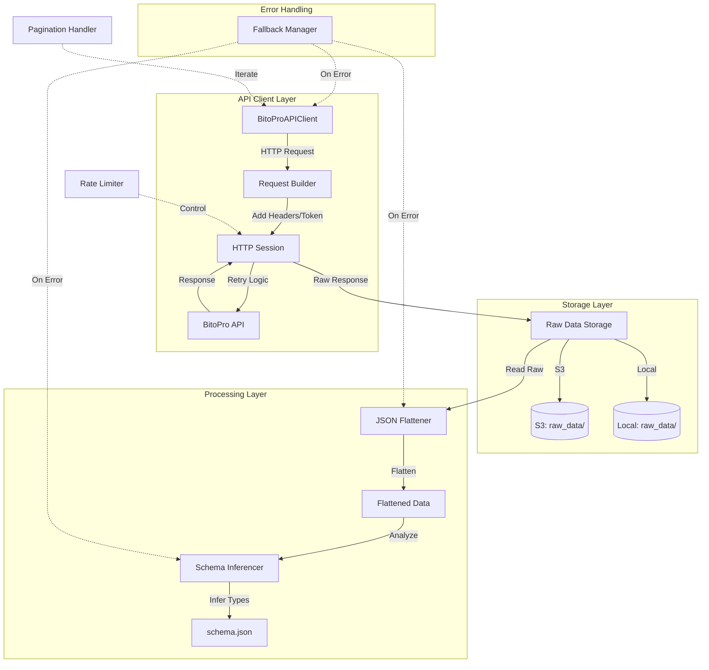
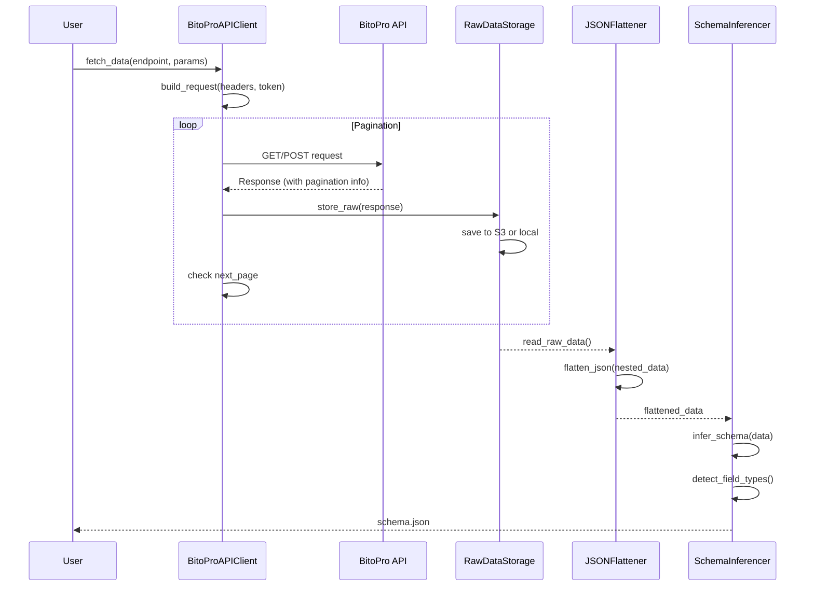

# Design Document: BitoPro API Data Ingestion Layer

## 概述

BitoPro API 資料接入層是一個健壯的資料擷取與處理系統，負責從 BitoPro 交易所 API 獲取資料、完整保存原始回應、進行資料扁平化、自動推斷 schema，並處理各種邊界情況（欄位缺失、型態變動等）。系統設計遵循容錯優先原則，確保在任何情況下都不會 crash，並提供完整的 fallback 機制。

核心特性：
- 支援 GET/POST 請求與完整的 HTTP header/token 管理
- 內建 retry、timeout、pagination 機制
- 原始資料完整保存（不改寫）至 S3 或本機
- 智能 JSON 扁平化，支援 nested JSON/list/dict 結構
- 自動 schema 推斷，識別 numeric/categorical/datetime/text/id-like 欄位
- 容錯設計，欄位缺失或型態變動時自動降級處理

## Architecture

### System Architecture Overview



### Main Workflow Sequence



## Components and Interfaces

### Component 1: BitoProAPIClient

**Purpose**: 負責與 BitoPro API 通訊，處理認證、重試、分頁等邏輯

**Interface**:
```python
from typing import Dict, List, Any, Optional
from dataclasses import dataclass
from enum import Enum

class HTTPMethod(Enum):
    GET = "GET"
    POST = "POST"

@dataclass
class APIConfig:
    base_url: str = "https://aws-event-api.bitopro.com/"
    timeout: int = 30
    max_retries: int = 3
    retry_backoff: float = 2.0
    rate_limit_per_second: float = 0.9

class BitoProAPIClient:
    def __init__(
        self,
        api_key: Optional[str] = None,
        api_secret: Optional[str] = None,
        config: Optional[APIConfig] = None
    ):
        """
        Initialize BitoPro API client
        
        Args:
            api_key: API key for authentication
            api_secret: API secret for authentication
            config: API configuration
        """
        pass
    
    def fetch_data(
        self,
        endpoint: str,
        method: HTTPMethod = HTTPMethod.GET,
        params: Optional[Dict[str, Any]] = None,
        headers: Optional[Dict[str, str]] = None,
        paginate: bool = True
    ) -> List[Dict[str, Any]]:
        """
        Fetch data from BitoPro API with retry and pagination
        
        Args:
            endpoint: API endpoint path
            method: HTTP method (GET or POST)
            params: Query parameters or request body
            headers: Additional HTTP headers
            paginate: Whether to automatically handle pagination
            
        Returns:
            List of response data (aggregated if paginated)
        """
        pass
    
    def _build_headers(
        self,
        custom_headers: Optional[Dict[str, str]] = None
    ) -> Dict[str, str]:
        """Build HTTP headers with authentication token"""
        pass
    
    def _execute_request(
        self,
        url: str,
        method: HTTPMethod,
        headers: Dict[str, str],
        params: Optional[Dict[str, Any]] = None
    ) -> Dict[str, Any]:
        """Execute HTTP request with retry logic"""
        pass
```

**Responsibilities**:
- 管理 API 認證（API key/secret）
- 建構 HTTP 請求（headers, token, params）
- 實作 retry 機制（exponential backoff）
- 處理 timeout 設定
- 自動處理 pagination
- Rate limiting 控制

### Component 2: RawDataStorage

**Purpose**: 負責原始資料的完整保存，支援 S3 和本機存儲

**Interface**:
```python
from abc import ABC, abstractmethod
from pathlib import Path
from datetime import datetime

class StorageBackend(ABC):
    @abstractmethod
    def save(self, data: Dict[str, Any], key: str) -> str:
        """Save raw data and return storage URI"""
        pass
    
    @abstractmethod
    def load(self, key: str) -> Dict[str, Any]:
        """Load raw data from storage"""
        pass

class S3Storage(StorageBackend):
    def __init__(self, bucket_name: str, prefix: str = "raw_data/"):
        """
        Initialize S3 storage backend
        
        Args:
            bucket_name: S3 bucket name (must be private)
            prefix: Key prefix for organization
        """
        pass
    
    def save(self, data: Dict[str, Any], key: str) -> str:
        """Save to S3 with encryption"""
        pass

class LocalStorage(StorageBackend):
    def __init__(self, base_path: str = "raw_data/"):
        """
        Initialize local file storage
        
        Args:
            base_path: Base directory for raw data
        """
        pass
    
    def save(self, data: Dict[str, Any], key: str) -> str:
        """Save to local filesystem"""
        pass

class RawDataStorage:
    def __init__(self, backend: StorageBackend):
        """
        Initialize raw data storage manager
        
        Args:
            backend: Storage backend (S3 or Local)
        """
        pass
    
    def store_raw_response(
        self,
        response: Dict[str, Any],
        endpoint: str,
        timestamp: Optional[datetime] = None
    ) -> str:
        """
        Store raw API response without modification
        
        Args:
            response: Raw API response (complete, unmodified)
            endpoint: API endpoint for organization
            timestamp: Optional timestamp for versioning
            
        Returns:
            Storage URI of saved data
        """
        pass
    
    def generate_key(
        self,
        endpoint: str,
        timestamp: datetime
    ) -> str:
        """Generate storage key with timestamp and endpoint"""
        pass
```

**Responsibilities**:
- 完整保存原始 API 回應（不改寫）
- 支援 S3 和本機兩種存儲後端
- 自動生成帶時間戳的 key
- 確保資料完整性
- S3 存儲使用加密

### Component 3: JSONFlattener

**Purpose**: 將 nested JSON 結構扁平化，支援 list 和 dict 嵌套

**Interface**:
```python
from typing import Dict, List, Any, Union

class JSONFlattener:
    def __init__(
        self,
        separator: str = "_",
        max_depth: int = 10,
        handle_lists: str = "explode"
    ):
        """
        Initialize JSON flattener
        
        Args:
            separator: Separator for nested keys (e.g., "user_address_city")
            max_depth: Maximum nesting depth to prevent infinite recursion
            handle_lists: How to handle lists ("explode", "index", "json_string")
        """
        pass
    
    def flatten(
        self,
        data: Union[Dict[str, Any], List[Dict[str, Any]]]
    ) -> List[Dict[str, Any]]:
        """
        Flatten nested JSON structure
        
        Args:
            data: Nested JSON data (dict or list of dicts)
            
        Returns:
            List of flattened dictionaries
        """
        pass
    
    def _flatten_dict(
        self,
        nested_dict: Dict[str, Any],
        parent_key: str = "",
        depth: int = 0
    ) -> Dict[str, Any]:
        """
        Recursively flatten a dictionary
        
        Args:
            nested_dict: Dictionary to flatten
            parent_key: Parent key for nested fields
            depth: Current recursion depth
            
        Returns:
            Flattened dictionary
        """
        pass
    
    def _handle_list_field(
        self,
        key: str,
        value: List[Any]
    ) -> Union[Dict[str, Any], List[Dict[str, Any]]]:
        """Handle list fields based on strategy"""
        pass
```

**Responsibilities**:
- 扁平化 nested JSON 結構
- 處理 list 欄位（explode 成多行或 index）
- 處理 dict 嵌套
- 防止無限遞迴（max_depth 限制）
- 保留原始欄位名稱語義

### Component 4: SchemaInferencer

**Purpose**: 自動推斷資料 schema，識別欄位型態

**Interface**:
```python
from enum import Enum
from typing import Dict, List, Any, Optional
from dataclasses import dataclass

class FieldType(Enum):
    NUMERIC = "numeric"
    CATEGORICAL = "categorical"
    DATETIME = "datetime"
    TEXT = "text"
    ID_LIKE = "id_like"
    BOOLEAN = "boolean"
    NULL = "null"
    MIXED = "mixed"

@dataclass
class FieldSchema:
    name: str
    inferred_type: FieldType
    nullable: bool
    sample_values: List[Any]
    null_count: int
    total_count: int
    confidence: float

class SchemaInferencer:
    def __init__(
        self,
        sample_size: int = 100,
        confidence_threshold: float = 0.8
    ):
        """
        Initialize schema inferencer
        
        Args:
            sample_size: Number of samples to analyze per field
            confidence_threshold: Minimum confidence for type inference
        """
        pass
    
    def infer_schema(
        self,
        data: List[Dict[str, Any]]
    ) -> Dict[str, FieldSchema]:
        """
        Infer schema from flattened data
        
        Args:
            data: List of flattened dictionaries
            
        Returns:
            Dictionary mapping field names to FieldSchema
        """
        pass
    
    def _infer_field_type(
        self,
        values: List[Any]
    ) -> tuple[FieldType, float]:
        """
        Infer field type from sample values
        
        Args:
            values: List of field values (non-null)
            
        Returns:
            Tuple of (inferred_type, confidence)
        """
        pass
    
    def _is_numeric(self, value: Any) -> bool:
        """Check if value is numeric"""
        pass
    
    def _is_datetime(self, value: Any) -> bool:
        """Check if value is datetime string"""
        pass
    
    def _is_id_like(self, value: Any) -> bool:
        """Check if value looks like an ID (UUID, hash, etc.)"""
        pass
    
    def export_schema(
        self,
        schema: Dict[str, FieldSchema],
        output_path: str = "schema.json"
    ) -> str:
        """Export schema to JSON file"""
        pass
```

**Responsibilities**:
- 自動推斷欄位型態（numeric, categorical, datetime, text, id-like）
- 計算型態推斷信心度
- 識別 nullable 欄位
- 處理混合型態欄位
- 輸出 schema.json

### Component 5: FallbackManager

**Purpose**: 處理錯誤情況，提供降級機制

**Interface**:
```python
from typing import Callable, Any, Optional
import logging

class FallbackManager:
    def __init__(self, logger: Optional[logging.Logger] = None):
        """Initialize fallback manager with logger"""
        pass
    
    def with_fallback(
        self,
        primary_func: Callable,
        fallback_func: Optional[Callable] = None,
        default_value: Any = None,
        error_handler: Optional[Callable] = None
    ) -> Any:
        """
        Execute function with fallback on error
        
        Args:
            primary_func: Primary function to execute
            fallback_func: Fallback function if primary fails
            default_value: Default value if both fail
            error_handler: Custom error handler
            
        Returns:
            Result from primary, fallback, or default
        """
        pass
    
    def handle_missing_field(
        self,
        data: Dict[str, Any],
        field: str,
        default: Any = None
    ) -> Any:
        """Handle missing field with default value"""
        pass
    
    def handle_type_mismatch(
        self,
        value: Any,
        expected_type: type,
        default: Any = None
    ) -> Any:
        """Handle type mismatch with conversion or default"""
        pass
```

**Responsibilities**:
- 提供統一的錯誤處理機制
- 處理欄位缺失情況
- 處理型態變動情況
- 記錄錯誤日誌
- 確保系統不會 crash

## Data Models

### Model 1: APIRequest

```python
@dataclass
class APIRequest:
    endpoint: str
    method: HTTPMethod
    params: Optional[Dict[str, Any]] = None
    headers: Optional[Dict[str, str]] = None
    timeout: int = 30
    retry_count: int = 0
    max_retries: int = 3
```

**Validation Rules**:
- `endpoint` must be non-empty string
- `method` must be GET or POST
- `timeout` must be positive
- `retry_count` <= `max_retries`

### Model 2: APIResponse

```python
@dataclass
class APIResponse:
    status_code: int
    data: Dict[str, Any]
    headers: Dict[str, str]
    timestamp: datetime
    request_id: str
    pagination_info: Optional[Dict[str, Any]] = None
```

**Validation Rules**:
- `status_code` must be valid HTTP status code
- `data` must be valid JSON-serializable dict
- `timestamp` must be valid datetime
- `request_id` must be unique

### Model 3: FlattenedRecord

```python
@dataclass
class FlattenedRecord:
    record_id: str
    source_endpoint: str
    flattened_data: Dict[str, Any]
    original_structure: Dict[str, Any]
    flatten_timestamp: datetime
```

**Validation Rules**:
- `record_id` must be unique
- `flattened_data` must have no nested structures
- `original_structure` preserved for reference

## Algorithmic Pseudocode

### Main Data Ingestion Algorithm

```python
def ingest_bitopro_data(
    endpoint: str,
    method: HTTPMethod = HTTPMethod.GET,
    params: Optional[Dict[str, Any]] = None,
    storage_backend: str = "s3"
) -> tuple[str, str]:
    """
    Main data ingestion workflow
    
    Preconditions:
    - endpoint is valid BitoPro API endpoint
    - API credentials are configured
    - Storage backend is available
    
    Postconditions:
    - Raw data stored in S3 or local
    - Flattened data generated
    - schema.json created
    - Returns (storage_uri, schema_path)
    
    Loop Invariants:
    - All fetched pages stored before processing next
    - Schema inference only on complete dataset
    """
    
    # Step 1: Initialize components
    client = BitoProAPIClient(
        api_key=get_api_key(),
        api_secret=get_api_secret()
    )
    
    storage = RawDataStorage(
        backend=S3Storage() if storage_backend == "s3" else LocalStorage()
    )
    
    flattener = JSONFlattener()
    inferencer = SchemaInferencer()
    fallback_mgr = FallbackManager()
    
    # Step 2: Fetch data with pagination and retry
    try:
        raw_responses = client.fetch_data(
            endpoint=endpoint,
            method=method,
            params=params,
            paginate=True
        )
        assert len(raw_responses) > 0
    except Exception as e:
        # Fallback: return empty result with error log
        fallback_mgr.log_error(e)
        return ("", "")
    
    # Step 3: Store raw data (complete, unmodified)
    storage_uris = []
    for response in raw_responses:
        # Loop invariant: each response stored independently
        uri = storage.store_raw_response(
            response=response,
            endpoint=endpoint,
            timestamp=datetime.now()
        )
        storage_uris.append(uri)
        assert uri is not None
    
    # Step 4: Flatten JSON structures
    flattened_data = []
    for response in raw_responses:
        try:
            flattened = flattener.flatten(response['data'])
            flattened_data.extend(flattened)
        except Exception as e:
            # Fallback: skip malformed response, continue processing
            fallback_mgr.log_error(f"Flatten error: {e}")
            continue
    
    assert len(flattened_data) >= 0
    
    # Step 5: Infer schema
    try:
        schema = inferencer.infer_schema(flattened_data)
        schema_path = inferencer.export_schema(schema)
    except Exception as e:
        # Fallback: create minimal schema
        schema_path = fallback_mgr.create_minimal_schema(flattened_data)
    
    return (storage_uris[0] if storage_uris else "", schema_path)
```

### JSON Flattening Algorithm

```python
def flatten_json(
    data: Union[Dict[str, Any], List[Any]],
    parent_key: str = "",
    separator: str = "_",
    depth: int = 0,
    max_depth: int = 10
) -> Union[Dict[str, Any], List[Dict[str, Any]]]:
    """
    Recursively flatten nested JSON structure
    
    Preconditions:
    - data is valid JSON-serializable object
    - depth <= max_depth
    - separator is non-empty string
    
    Postconditions:
    - Returns flattened structure with no nesting beyond depth 1
    - All keys are strings
    - List fields handled according to strategy
    
    Loop Invariants:
    - depth increases by 1 for each recursion level
    - All processed keys maintain parent_key prefix
    """
    
    # Base case: max depth reached
    if depth >= max_depth:
        return {parent_key: json.dumps(data)} if parent_key else {"_raw": json.dumps(data)}
    
    # Handle list
    if isinstance(data, list):
        if not data:
            return {parent_key: []} if parent_key else {"_empty_list": []}
        
        # Strategy: explode list into multiple records
        result = []
        for i, item in enumerate(data):
            if isinstance(item, dict):
                flattened_item = flatten_json(
                    item,
                    parent_key=parent_key,
                    separator=separator,
                    depth=depth + 1,
                    max_depth=max_depth
                )
                result.append(flattened_item)
            else:
                # Primitive value in list
                key = f"{parent_key}{separator}{i}" if parent_key else str(i)
                result.append({key: item})
        
        return result
    
    # Handle dict
    if isinstance(data, dict):
        flattened = {}
        
        for key, value in data.items():
            # Build new key
            new_key = f"{parent_key}{separator}{key}" if parent_key else key
            
            # Recursive flattening
            if isinstance(value, dict):
                nested_flat = flatten_json(
                    value,
                    parent_key=new_key,
                    separator=separator,
                    depth=depth + 1,
                    max_depth=max_depth
                )
                flattened.update(nested_flat)
            
            elif isinstance(value, list):
                # Handle list field
                if not value:
                    flattened[new_key] = None
                elif all(isinstance(v, (str, int, float, bool, type(None))) for v in value):
                    # List of primitives: keep as JSON string
                    flattened[new_key] = json.dumps(value)
                else:
                    # List of objects: explode (handled by caller)
                    flattened[new_key] = value
            
            else:
                # Primitive value
                flattened[new_key] = value
        
        return flattened
    
    # Primitive value
    return {parent_key: data} if parent_key else {"value": data}
```

### Schema Inference Algorithm

```python
def infer_field_type(
    values: List[Any],
    field_name: str
) -> tuple[FieldType, float]:
    """
    Infer field type from sample values
    
    Preconditions:
    - values is non-empty list
    - All None values filtered out
    
    Postconditions:
    - Returns (FieldType, confidence_score)
    - confidence_score is between 0 and 1
    
    Loop Invariants:
    - Type counters remain consistent
    - All values examined exactly once
    """
    
    if not values:
        return (FieldType.NULL, 1.0)
    
    # Initialize type counters
    numeric_count = 0
    datetime_count = 0
    id_like_count = 0
    boolean_count = 0
    text_count = 0
    
    total = len(values)
    
    # Analyze each value
    for value in values:
        # Check numeric
        if isinstance(value, (int, float)):
            numeric_count += 1
        elif isinstance(value, str):
            # Try parse as number
            try:
                float(value)
                numeric_count += 1
                continue
            except ValueError:
                pass
            
            # Check datetime patterns
            if is_datetime_string(value):
                datetime_count += 1
                continue
            
            # Check ID-like patterns
            if is_id_like(value, field_name):
                id_like_count += 1
                continue
            
            # Default to text
            text_count += 1
        
        elif isinstance(value, bool):
            boolean_count += 1
    
    # Determine dominant type
    type_scores = {
        FieldType.NUMERIC: numeric_count / total,
        FieldType.DATETIME: datetime_count / total,
        FieldType.ID_LIKE: id_like_count / total,
        FieldType.BOOLEAN: boolean_count / total,
        FieldType.TEXT: text_count / total
    }
    
    dominant_type = max(type_scores, key=type_scores.get)
    confidence = type_scores[dominant_type]
    
    # If no clear dominant type (confidence < 0.6), mark as MIXED
    if confidence < 0.6:
        return (FieldType.MIXED, confidence)
    
    # Special case: if numeric but field name suggests ID, prefer ID_LIKE
    if dominant_type == FieldType.NUMERIC and is_id_field_name(field_name):
        return (FieldType.ID_LIKE, confidence * 0.9)
    
    return (dominant_type, confidence)


def is_datetime_string(value: str) -> bool:
    """
    Check if string matches datetime patterns
    
    Preconditions:
    - value is non-empty string
    
    Postconditions:
    - Returns True if value matches common datetime formats
    """
    
    datetime_patterns = [
        r'\d{4}-\d{2}-\d{2}',  # YYYY-MM-DD
        r'\d{4}-\d{2}-\d{2}T\d{2}:\d{2}:\d{2}',  # ISO 8601
        r'\d{2}/\d{2}/\d{4}',  # MM/DD/YYYY
        r'\d{10}',  # Unix timestamp (10 digits)
        r'\d{13}',  # Unix timestamp milliseconds (13 digits)
    ]
    
    for pattern in datetime_patterns:
        if re.match(pattern, value):
            return True
    
    return False


def is_id_like(value: str, field_name: str) -> bool:
    """
    Check if value looks like an identifier
    
    Preconditions:
    - value is non-empty string
    - field_name is non-empty string
    
    Postconditions:
    - Returns True if value matches ID patterns
    """
    
    # Check field name hints
    if is_id_field_name(field_name):
        return True
    
    # Check UUID pattern
    uuid_pattern = r'^[0-9a-f]{8}-[0-9a-f]{4}-[0-9a-f]{4}-[0-9a-f]{4}-[0-9a-f]{12}$'
    if re.match(uuid_pattern, value, re.IGNORECASE):
        return True
    
    # Check hash-like pattern (32+ hex chars)
    if re.match(r'^[0-9a-f]{32,}$', value, re.IGNORECASE):
        return True
    
    # Check alphanumeric ID pattern (e.g., "USR123456")
    if re.match(r'^[A-Z]{2,5}\d{4,}$', value):
        return True
    
    return False


def is_id_field_name(field_name: str) -> bool:
    """Check if field name suggests it's an ID field"""
    
    id_keywords = ['id', 'uuid', 'key', 'hash', 'token', 'code']
    field_lower = field_name.lower()
    
    return any(keyword in field_lower for keyword in id_keywords)
```

## Key Functions with Formal Specifications

### Function 1: fetch_data()

```python
def fetch_data(
    endpoint: str,
    method: HTTPMethod = HTTPMethod.GET,
    params: Optional[Dict[str, Any]] = None,
    headers: Optional[Dict[str, str]] = None,
    paginate: bool = True
) -> List[Dict[str, Any]]:
    """Fetch data from BitoPro API"""
    pass
```

**Preconditions:**
- `endpoint` is non-empty string
- `method` is GET or POST
- API credentials are configured
- Network is accessible

**Postconditions:**
- Returns list of API responses
- All responses have valid structure
- If paginate=True, all pages fetched
- Rate limiting maintained throughout

**Loop Invariants:**
- Each page fetched respects rate limit
- All previous pages stored before fetching next

### Function 2: flatten()

```python
def flatten(
    data: Union[Dict[str, Any], List[Dict[str, Any]]]
) -> List[Dict[str, Any]]:
    """Flatten nested JSON structure"""
    pass
```

**Preconditions:**
- `data` is valid JSON-serializable object
- `data` is not None

**Postconditions:**
- Returns list of flattened dictionaries
- No nested dicts in result (depth = 1)
- All original data preserved
- List fields handled according to strategy

**Loop Invariants:**
- Recursion depth never exceeds max_depth
- All keys maintain parent prefix

### Function 3: infer_schema()

```python
def infer_schema(
    data: List[Dict[str, Any]]
) -> Dict[str, FieldSchema]:
    """Infer schema from flattened data"""
    pass
```

**Preconditions:**
- `data` is non-empty list
- All items in data are dictionaries
- Data is flattened (no nesting)

**Postconditions:**
- Returns schema for all fields
- Each field has inferred type and confidence
- Nullable fields identified
- Sample values included

**Loop Invariants:**
- All fields processed exactly once
- Type inference consistent across samples

## Example Usage

### Example 1: Basic Data Ingestion

```python
from bitopro_ingestion import BitoProAPIClient, RawDataStorage, S3Storage

# Initialize client
client = BitoProAPIClient(
    api_key="your_api_key",
    api_secret="your_api_secret"
)

# Fetch data
responses = client.fetch_data(
    endpoint="/v1/transactions",
    method=HTTPMethod.GET,
    params={"limit": 100, "start_time": "2024-01-01"},
    paginate=True
)

# Store raw data
storage = RawDataStorage(backend=S3Storage(bucket_name="my-private-bucket"))
uri = storage.store_raw_response(
    response=responses[0],
    endpoint="/v1/transactions"
)

print(f"Raw data stored at: {uri}")
```

### Example 2: Complete Workflow

```python
from bitopro_ingestion import (
    ingest_bitopro_data,
    JSONFlattener,
    SchemaInferencer
)

# Run complete ingestion workflow
storage_uri, schema_path = ingest_bitopro_data(
    endpoint="/v1/transactions",
    method=HTTPMethod.GET,
    params={"limit": 1000},
    storage_backend="s3"
)

print(f"Data stored: {storage_uri}")
print(f"Schema saved: {schema_path}")

# Load and inspect schema
with open(schema_path, 'r') as f:
    schema = json.load(f)
    
for field_name, field_info in schema.items():
    print(f"{field_name}: {field_info['inferred_type']} "
          f"(confidence: {field_info['confidence']:.2f})")
```

### Example 3: Handling Nested JSON

```python
# Sample nested data
nested_data = {
    "user": {
        "id": "USR123",
        "profile": {
            "name": "Alice",
            "address": {
                "city": "Taipei",
                "country": "Taiwan"
            }
        }
    },
    "transactions": [
        {"id": "TXN001", "amount": 100.0},
        {"id": "TXN002", "amount": 200.0}
    ]
}

# Flatten
flattener = JSONFlattener(separator="_", handle_lists="explode")
flattened = flattener.flatten(nested_data)

# Result (exploded by transactions list):
# [
#   {
#     "user_id": "USR123",
#     "user_profile_name": "Alice",
#     "user_profile_address_city": "Taipei",
#     "user_profile_address_country": "Taiwan",
#     "transactions_id": "TXN001",
#     "transactions_amount": 100.0
#   },
#   {
#     "user_id": "USR123",
#     "user_profile_name": "Alice",
#     "user_profile_address_city": "Taipei",
#     "user_profile_address_country": "Taiwan",
#     "transactions_id": "TXN002",
#     "transactions_amount": 200.0
#   }
# ]
```

### Example 4: Error Handling with Fallback

```python
from bitopro_ingestion import FallbackManager

fallback_mgr = FallbackManager()

# Handle missing field
data = {"name": "Alice", "age": 30}
email = fallback_mgr.handle_missing_field(
    data=data,
    field="email",
    default="unknown@example.com"
)
# Result: "unknown@example.com"

# Handle type mismatch
value = "not_a_number"
amount = fallback_mgr.handle_type_mismatch(
    value=value,
    expected_type=float,
    default=0.0
)
# Result: 0.0 (with error logged)
```

### Example 5: Schema Inference Output

```python
# Input data
data = [
    {
        "transaction_id": "TXN001",
        "amount": 100.50,
        "timestamp": "2024-01-01T10:00:00",
        "user_id": "USR123",
        "status": "completed"
    },
    {
        "transaction_id": "TXN002",
        "amount": 200.75,
        "timestamp": "2024-01-01T11:00:00",
        "user_id": "USR456",
        "status": "pending"
    }
]

# Infer schema
inferencer = SchemaInferencer()
schema = inferencer.infer_schema(data)

# Output schema.json:
{
    "transaction_id": {
        "name": "transaction_id",
        "inferred_type": "id_like",
        "nullable": false,
        "sample_values": ["TXN001", "TXN002"],
        "null_count": 0,
        "total_count": 2,
        "confidence": 1.0
    },
    "amount": {
        "name": "amount",
        "inferred_type": "numeric",
        "nullable": false,
        "sample_values": [100.50, 200.75],
        "null_count": 0,
        "total_count": 2,
        "confidence": 1.0
    },
    "timestamp": {
        "name": "timestamp",
        "inferred_type": "datetime",
        "nullable": false,
        "sample_values": ["2024-01-01T10:00:00", "2024-01-01T11:00:00"],
        "null_count": 0,
        "total_count": 2,
        "confidence": 1.0
    },
    "user_id": {
        "name": "user_id",
        "inferred_type": "id_like",
        "nullable": false,
        "sample_values": ["USR123", "USR456"],
        "null_count": 0,
        "total_count": 2,
        "confidence": 1.0
    },
    "status": {
        "name": "status",
        "inferred_type": "categorical",
        "nullable": false,
        "sample_values": ["completed", "pending"],
        "null_count": 0,
        "total_count": 2,
        "confidence": 1.0
    }
}
```

## Error Handling

### Error Scenario 1: API Request Failure

**Condition**: BitoPro API returns 5xx error or network timeout
**Response**: Retry with exponential backoff (max 3 retries)
**Recovery**: If all retries fail, log error and return empty result

### Error Scenario 2: Missing Field in Response

**Condition**: Expected field not present in API response
**Response**: Use FallbackManager to provide default value
**Recovery**: Continue processing with default, log warning

### Error Scenario 3: Type Mismatch

**Condition**: Field value type changes between requests
**Response**: Mark field as MIXED type in schema
**Recovery**: Store value as string, log type change

### Error Scenario 4: Malformed JSON

**Condition**: API returns invalid JSON
**Response**: Skip malformed response, continue with next page
**Recovery**: Log error with request details, partial data still processed

### Error Scenario 5: Storage Failure

**Condition**: S3 or local storage write fails
**Response**: Retry write operation (max 3 times)
**Recovery**: If all retries fail, fallback to alternative storage or in-memory cache

## Testing Strategy

### Unit Testing Approach

- Test each component independently
- Mock external dependencies (API, S3)
- Test error handling paths
- Validate preconditions and postconditions
- Test edge cases (empty data, null values, max depth)

### Property-Based Testing Approach

**Property Test Library**: Hypothesis (Python)

**Key Properties to Test**:
1. Flattening is reversible (within information loss bounds)
2. Schema inference is consistent across samples
3. Type inference confidence correlates with type purity
4. Fallback always returns valid value
5. Rate limiting never exceeds threshold

### Integration Testing Approach

- Test complete workflow end-to-end
- Use BitoPro API sandbox/mock
- Verify S3 storage integration
- Test pagination with multiple pages
- Validate schema.json output format

## Performance Considerations

- Batch processing for large datasets
- Streaming JSON parsing for memory efficiency
- Parallel processing for multiple endpoints
- Connection pooling for HTTP requests
- Lazy loading for schema inference (sample-based)

## Security Considerations

- API credentials stored in AWS Secrets Manager
- S3 buckets configured as private
- HTTPS only for API communication
- Input validation to prevent injection attacks
- Rate limiting to prevent abuse

## Dependencies

- `requests`: HTTP client
- `boto3`: AWS SDK (S3, Secrets Manager)
- `python-dateutil`: Datetime parsing
- `hypothesis`: Property-based testing
- `pytest`: Unit testing framework
