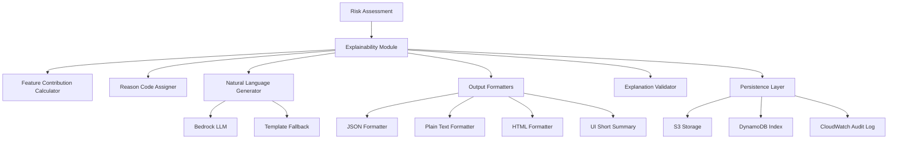
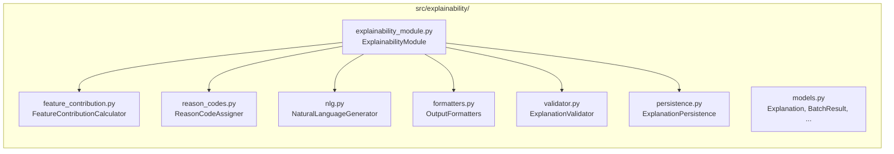

# Design Document: Explainability Module

## Overview

The Explainability Module transforms risk assessment results from the Crypto Suspicious Account Detection system into human-readable, auditable, and actionable explanations. It sits downstream of the risk assessment pipeline and serves multiple consumers: fraud analysts reviewing individual accounts, compliance officers generating reports, UI developers displaying summaries, and audit systems requiring long-term retention.

The module supports two explanation sources — rule-based systems and AI model predictions — and two output modes: single-account and batch. It integrates with Amazon Bedrock for natural language generation, with a template-based fallback for resilience. Explanations are persisted to S3 and indexed in DynamoDB for retrieval and audit.



## Architecture

The module follows the same layered, class-based pattern established in the existing codebase (`src/common/`, `src/ingestion/`). It lives under `src/explainability/` and exposes a single entry-point class `ExplainabilityModule` that orchestrates the sub-components.



Key design decisions:
- **Stateless sub-components**: Each sub-component is independently instantiable and testable.
- **Reuse existing infrastructure**: `RateLimiter`, `S3Storage`, and `get_aws_clients()` from `src/common/` are reused directly.
- **Bedrock via existing AWS client pattern**: Bedrock calls follow the same boto3 client pattern as the rest of the system.
- **Dataclasses for models**: Consistent with `src/common/models.py`.

## Components and Interfaces

### ExplainabilityModule

The top-level orchestrator. Accepts a `RiskAssessment` (or list) and returns an `Explanation` (or `BatchResult`).

```python
class ExplainabilityModule:
    def explain(
        self,
        assessment: RiskAssessment,
        language: str = "en",
        use_bedrock: bool = True,
    ) -> Explanation: ...

    def explain_batch(
        self,
        assessments: List[RiskAssessment],
        language: str = "en",
        use_bedrock: bool = True,
    ) -> BatchResult: ...
```

### FeatureContributionCalculator

Computes normalized feature contributions from either SHAP values, model feature importance, or rule weights.

```python
class FeatureContributionCalculator:
    def calculate(
        self,
        assessment: RiskAssessment,
    ) -> Dict[str, float]: ...  # feature_name -> normalized contribution [0,1]

    def get_top_features(
        self,
        contributions: Dict[str, float],
        threshold: float = 0.05,
        max_fallback: int = 5,
    ) -> List[FeatureContribution]: ...
```

### ReasonCodeAssigner

Maps risk factors to standardized `ReasonCode` values.

```python
class ReasonCodeAssigner:
    def assign(self, risk_factors: List[str]) -> List[str]: ...  # returns ReasonCode strings
```

### NaturalLanguageGenerator

Generates `Natural_Language_Summary` using Bedrock LLM or template fallback.

```python
class NaturalLanguageGenerator:
    def generate(
        self,
        assessment: RiskAssessment,
        top_features: List[FeatureContribution],
        language: str = "en",
    ) -> Tuple[str, bool]: ...  # (summary_text, is_fallback)
```

### OutputFormatters

Converts an `Explanation` to JSON, plain text, HTML, or UI short summary.

```python
class OutputFormatters:
    def to_json(self, explanation: Explanation) -> str: ...
    def to_text(self, explanation: Explanation) -> str: ...
    def to_html(self, explanation: Explanation) -> str: ...
    def to_ui_summary(self, explanation: Explanation) -> str: ...  # <= 200 chars
```

### ExplanationValidator

Validates a completed `Explanation` object against all structural invariants.

```python
class ExplanationValidator:
    def validate(self, explanation: Explanation) -> None: ...  # raises on failure
```

### ExplanationPersistence

Stores explanations to S3 and DynamoDB, and retrieves them.

```python
class ExplanationPersistence:
    def store(self, explanation: Explanation) -> str: ...  # returns s3_uri
    def get_latest(self, account_id: str) -> Explanation: ...
    def get_range(self, account_id: str, start: datetime, end: datetime) -> List[Explanation]: ...
```

## Data Models

All models live in `src/explainability/models.py` and use Python `dataclasses`, consistent with `src/common/models.py`.

```python
from dataclasses import dataclass, field
from datetime import datetime
from typing import Dict, List, Optional
from src.common.models import RiskLevel

@dataclass
class FeatureContribution:
    feature_name: str
    contribution: float          # normalized [0, 1]
    raw_value: Optional[float]   # original feature value
    context_label: str           # e.g. "significantly above normal"

@dataclass
class Explanation:
    account_id: str
    risk_score: float
    risk_level: RiskLevel
    reason_codes: List[str]
    top_features: List[FeatureContribution]
    feature_contributions: Dict[str, float]  # all features, normalized
    natural_language_summary: str
    language: str                            # "en" or "zh-TW"
    is_fallback: bool                        # True if template-based NLG was used
    is_validated: bool
    generated_at: datetime
    generation_time_ms: float
    s3_uri: Optional[str] = None
    triggered_rules: Optional[List[RuleContribution]] = None  # rule-based only

@dataclass
class RuleContribution:
    rule_name: str
    score_contribution: float
    percentage: float            # contribution / total_score
    trigger_condition: str
    is_major: bool               # percentage > 0.20

@dataclass
class BatchResult:
    explanations: List[Explanation]
    total: int
    successful: int
    failed: int
    errors: Dict[str, str]       # account_id -> error message
```

### Feature Contextualization Thresholds

Defined as constants in `src/explainability/models.py`:

| Feature | Threshold | Label |
|---|---|---|
| `total_volume` | > 100,000 | "significantly above normal" |
| `night_transaction_ratio` | > 0.3 | "unusually high" |
| `round_number_ratio` | > 0.5 | "suspicious pattern detected" |
| `concentration_score` | > 0.7 | "highly concentrated" |
| `rapid_transaction_count` | > 10 | "abnormally frequent" |
| `velocity_score` | > 10 | "extremely high velocity" |
| (default) | within range | "within normal range" |

### Reason Code Mapping

| Risk Factor Pattern | Reason Code |
|---|---|
| high transaction volume | `HIGH_VOLUME` |
| night transactions | `NIGHT_ACTIVITY` |
| round number amounts | `ROUND_AMOUNTS` |
| high counterparty concentration | `HIGH_CONCENTRATION` |
| rapid transactions | `RAPID_TRANSACTIONS` |
| high velocity | `HIGH_VELOCITY` |
| (no match) | `OTHER` |

### S3 Storage Path

```
explanations/{account_id}/{timestamp_iso}.json
```

Encrypted with AES-256 server-side encryption, consistent with `S3Storage` in `src/ingestion/storage.py`.

### DynamoDB Schema

| Attribute | Type | Role |
|---|---|---|
| `account_id` | String | Partition key |
| `timestamp` | String (ISO) | Sort key |
| `risk_score` | Number | |
| `risk_level` | String | |
| `reason_codes` | List | |
| `s3_uri` | String | |


## Correctness Properties

*A property is a characteristic or behavior that should hold true across all valid executions of a system — essentially, a formal statement about what the system should do. Properties serve as the bridge between human-readable specifications and machine-verifiable correctness guarantees.*

**Property Reflection**: After reviewing all testable criteria, several were consolidated:
- 1.4, 3.5, and 3.6 all describe the normalization invariant → merged into Property 1
- 1.7 and the sorting in 7.4 both describe descending-order sorting → merged into Property 2
- 1.8, 4.2–4.8, and 4.9 all describe reason code assignment completeness → merged into Property 3
- 5.1 and 5.8 both describe the 200-char limit with truncation → merged into Property 5
- 5.2–5.5 all describe risk-level prefix rules → merged into Property 6
- 6.2 and 6.5 are redundant → kept as Property 8
- 3.7 and 3.8 describe top-feature selection with threshold and fallback → merged into Property 4

---

### Property 1: Feature Contribution Normalization

*For any* set of feature contributions calculated from a `RiskAssessment` (whether from SHAP values, model feature importance, or rule weights), the resulting normalized contributions must sum to 1.0 within a tolerance of 0.01, and every individual contribution must be in the range [0, 1].

**Validates: Requirements 1.4, 3.5, 3.6**

---

### Property 2: Top Features Are Sorted Descending

*For any* `Explanation` object, the `top_features` list must be sorted by `contribution` in descending order — i.e., for any two adjacent features at index i and i+1, `top_features[i].contribution >= top_features[i+1].contribution`.

**Validates: Requirements 1.7, 7.4**

---

### Property 3: Every Risk Factor Gets a Reason Code

*For any* `RiskAssessment` with a non-empty `risk_factors` list, the resulting `Explanation` must contain at least one `ReasonCode`, and every risk factor must map to exactly one code (either a predefined code or `OTHER`).

**Validates: Requirements 1.8, 4.2, 4.3, 4.4, 4.5, 4.6, 4.7, 4.8, 4.9**

---

### Property 4: Top Feature Selection Threshold

*For any* normalized feature contribution map, `get_top_features` must return all features with contribution > 0.05; if no features exceed 0.05, it must return the top 5 features by contribution value.

**Validates: Requirements 3.7, 3.8**

---

### Property 5: UI Summary Length Constraint

*For any* `Explanation`, `to_ui_summary()` must return a string of at most 200 characters; if the natural content would exceed 200 characters, the result must end with `"..."`.

**Validates: Requirements 5.1, 5.8**

---

### Property 6: UI Summary Risk Level Prefix

*For any* `Explanation`, `to_ui_summary()` must begin with the correct prefix for the risk level: `"🚨 CRITICAL:"` for CRITICAL, `"⚠️ HIGH RISK:"` for HIGH, `"⚡ MEDIUM RISK:"` for MEDIUM, and `"✓ LOW RISK:"` for LOW.

**Validates: Requirements 5.2, 5.3, 5.4, 5.5**

---

### Property 7: UI Summary Contains Score and Primary Factor

*For any* `Explanation`, `to_ui_summary()` must contain the `risk_score` value as a substring and must mention the primary risk factor (the first reason code or top feature name).

**Validates: Requirements 5.6, 5.7**

---

### Property 8: Batch Output Completeness and Order

*For any* list of `RiskAssessment` objects passed to `explain_batch`, the returned `BatchResult.explanations` list must preserve the same order as the input, and `successful + failed == total == len(input)`.

**Validates: Requirements 6.2, 6.3, 6.5, 6.6**

---

### Property 9: Batch Resilience — Single Failure Does Not Abort

*For any* batch of assessments where exactly one assessment is invalid (e.g., risk_score out of range), the remaining valid assessments must still produce `Explanation` objects in the result, and the failed count must equal 1.

**Validates: Requirements 6.4**

---

### Property 10: Template Fallback Produces Non-Empty Summary

*For any* `RiskAssessment` when Bedrock is unavailable, `NaturalLanguageGenerator.generate()` must return a non-empty string of at least 20 characters, and the returned `is_fallback` flag must be `True`.

**Validates: Requirements 2.9, 11.1, 11.2, 11.7, 11.8**

---

### Property 11: Template Substitution Round Trip

*For any* `RiskAssessment`, the template-based summary must contain the actual `risk_score` value and the primary risk factor name as substrings (i.e., placeholders are fully substituted).

**Validates: Requirements 11.3, 11.4, 11.5, 11.6, 11.7**

---

### Property 12: JSON Output Contains All Required Fields

*For any* `Explanation`, `to_json()` must produce a valid JSON string containing all required fields: `account_id`, `risk_score`, `risk_level`, `reason_codes`, `top_features`, `natural_language_summary`, and `feature_contributions`.

**Validates: Requirements 9.1, 9.4**

---

### Property 13: Output Escaping Prevents Injection

*For any* `Explanation` where `natural_language_summary` contains HTML special characters (`<`, `>`, `&`, `"`, `'`), `to_html()` must escape them so the raw characters do not appear unescaped in the output.

**Validates: Requirements 9.8**

---

### Property 14: Explanation Validation Invariants

*For any* generated `Explanation`, `ExplanationValidator.validate()` must pass if and only if: `account_id` is non-empty, `risk_score` is in [0, 100], `risk_level` matches the score range, `natural_language_summary` is at least 20 characters, at least one `reason_code` is present, and `feature_contributions` sum to 1.0 ± 0.01.

**Validates: Requirements 13.1, 13.2, 13.3, 13.4, 13.5, 13.6, 13.7, 13.8**

---

### Property 15: Feature Contextualization Labels

*For any* feature value, `contextualize(feature_name, value)` must return the correct label based on the defined thresholds (e.g., `total_volume > 100000` → `"significantly above normal"`), and values within normal range must return `"within normal range"`.

**Validates: Requirements 12.1, 12.2, 12.3, 12.4, 12.5, 12.6, 12.7, 12.8**

---

### Property 16: Rule Contribution Percentages Sum to 1.0

*For any* rule-based `RiskAssessment` with triggered rules, the sum of all `RuleContribution.percentage` values must equal 1.0 within a tolerance of 0.01, and rules contributing more than 20% must have `is_major == True`.

**Validates: Requirements 7.3, 7.6**

---

### Property 17: Bedrock Prompt Contains Required Fields

*For any* `RiskAssessment` passed to `NaturalLanguageGenerator` with Bedrock enabled, the constructed prompt string must contain the `risk_score`, `risk_level`, and at least one `risk_factor` as substrings.

**Validates: Requirements 2.7, 8.2**

---

### Property 18: Multilingual Language Fallback

*For any* unsupported language code passed to `explain()`, the returned `Explanation.language` must be `"en"` and the `natural_language_summary` must be in English.

**Validates: Requirements 14.7**

---

## Error Handling

### Validation Errors

`ExplanationValidator.validate()` raises `ExplanationValidationError` (a custom exception) with a descriptive message when any invariant fails. The caller (`ExplainabilityModule`) catches this, logs it to CloudWatch, and re-raises.

### Bedrock Failures

`NaturalLanguageGenerator` wraps all Bedrock calls in a try/except. On `ClientError`, timeout, or empty response, it logs the failure reason and falls back to template-based generation. The `is_fallback` flag on the `Explanation` records this.

### Batch Processing Errors

`explain_batch` wraps each individual `explain()` call in a try/except. Failures are recorded in `BatchResult.errors` (keyed by `account_id`) and processing continues. The batch never raises; it always returns a `BatchResult`.

### Storage Errors

`ExplanationPersistence.store()` raises `IOError` on S3 or DynamoDB failure (consistent with `S3Storage`). The caller logs the error and the explanation is still returned to the caller without a `s3_uri`.

### Invalid Risk Score

`ExplainabilityModule.explain()` raises `ValueError` immediately if `risk_score` is outside [0, 100], before any processing begins.

### Unsupported Language

If the `language` parameter is not `"en"` or `"zh-TW"`, the module logs a warning and defaults to `"en"`.

## Testing Strategy

### Dual Testing Approach

Both unit tests and property-based tests are required. Unit tests cover specific examples, integration points, and edge cases. Property tests verify universal invariants across randomly generated inputs.

### Property-Based Testing

The project already uses **Hypothesis** (evidenced by `.hypothesis/` directory). All property tests use Hypothesis with `@given` decorators.

- Minimum **100 iterations** per property test (Hypothesis default; increase with `settings(max_examples=100)`)
- Each property test must include a comment referencing the design property:
  `# Feature: explainability-module, Property N: <property_text>`
- Each correctness property above maps to exactly one `@given`-decorated test function

**Property test file**: `tests/property/test_explainability_property.py`

Example structure:
```python
from hypothesis import given, settings
from hypothesis import strategies as st

# Feature: explainability-module, Property 1: Feature Contribution Normalization
@given(st.lists(st.floats(min_value=0.0, max_value=1000.0), min_size=1, max_size=20))
@settings(max_examples=100)
def test_feature_contribution_normalization(raw_values):
    contributions = normalize_contributions(dict(enumerate(raw_values)))
    total = sum(contributions.values())
    assert abs(total - 1.0) <= 0.01
    assert all(0.0 <= v <= 1.0 for v in contributions.values())
```

### Unit Testing

**Unit test file**: `tests/unit/test_explainability.py`

Focus areas:
- Specific reason code mappings (e.g., "high transaction volume" → `HIGH_VOLUME`)
- Template string substitution for each risk level and language
- HTML color coding for each risk level
- Bedrock prompt construction with known inputs
- DynamoDB/S3 key format validation
- `RiskLevel.from_score` boundary values (0, 25, 26, 50, 51, 75, 76, 100)
- Validation error messages for each failure mode

### Integration Testing

**Integration test file**: `tests/integration/test_explainability_workflow.py`

- End-to-end: `RiskAssessment` → `ExplainabilityModule.explain()` → `Explanation` → `ExplanationValidator.validate()`
- Batch: list of assessments including one invalid → verify `BatchResult` counts
- Persistence round trip: store then retrieve by `account_id`

### Test Coverage Targets

- Unit + property tests must cover all 18 correctness properties
- Each property test references its design property number in a comment
- Edge cases (3.8, 5.8) are covered as `@example` decorators on the relevant property tests
