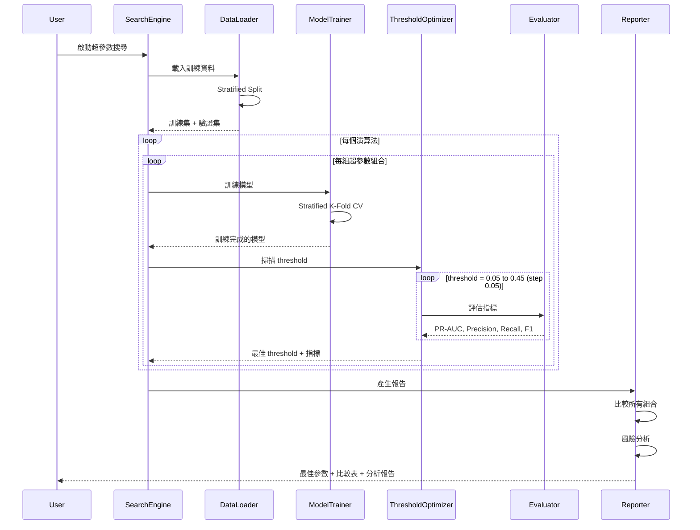

# Design Document: Hyperparameter Search Optimization

## Overview

超參數搜尋優化模組是一個專為防詐/可疑帳號偵測設計的機器學習模型調優系統。系統支援多種主流演算法（Logistic Regression、Decision Tree、Random Forest、XGBoost、LightGBM），針對極度不平衡資料集進行最佳化，使用 stratified k-fold 交叉驗證，並以 PR-AUC、Precision、Recall、F1 為主要評估指標。系統會自動掃描多個 threshold 值（0.05-0.45），找出最佳超參數組合與決策閾值，並產出完整的比較分析報告。

## Main Algorithm/Workflow



## Core Interfaces/Types

```python
from dataclasses import dataclass
from typing import Dict, List, Tuple, Optional, Any
from enum import Enum
import numpy as np
from sklearn.model_selection import StratifiedKFold

class ModelType(Enum):
    LOGISTIC_REGRESSION = "logistic_regression"
    DECISION_TREE = "decision_tree"
    RANDOM_FOREST = "random_forest"
    XGBOOST = "xgboost"
    LIGHTGBM = "lightgbm"

@dataclass
class SearchConfig:
    """超參數搜尋配置"""
    model_type: ModelType
    param_grid: Dict[str, List[Any]]
    cv_folds: int = 5
    threshold_range: Tuple[float, float, float] = (0.10, 0.45, 0.05)  # (start, end, step)
    extended_threshold_range: Optional[Tuple[float, float, float]] = (0.05, 0.10, 0.05)  # 極度不平衡時使用
    random_state: int = 42
    n_jobs: int = -1

@dataclass
class EvaluationMetrics:
    """評估指標"""
    pr_auc: float
    precision: float
    recall: float
    f1: float
    threshold: float
    confusion_matrix: np.ndarray
    
@dataclass
class SearchResult:
    """單次搜尋結果"""
    model_type: ModelType
    best_params: Dict[str, Any]
    best_threshold: float
    best_metrics: EvaluationMetrics
    all_results: List[Dict[str, Any]]  # 所有組合的結果
    cv_scores: Dict[str, List[float]]  # 交叉驗證分數
    training_time: float

@dataclass
class ComparisonReport:
    """比較報告"""
    best_model: ModelType
    best_params: Dict[str, Any]
    best_threshold: float
    best_metrics: EvaluationMetrics
    all_results: List[SearchResult]
    comparison_table: str  # Markdown 格式的比較表
    risk_analysis: str  # 風險分析文字
```

## Key Functions/Methods

```python
class HyperparameterSearchEngine:
    """超參數搜尋引擎"""
    
    def __init__(self, config: SearchConfig):
        """初始化搜尋引擎"""
        self.config = config
        self.stratified_kfold = StratifiedKFold(
            n_splits=config.cv_folds,
            shuffle=True,
            random_state=config.random_state
        )
    
    def search(
        self,
        X_train: np.ndarray,
        y_train: np.ndarray,
        X_val: np.ndarray,
        y_val: np.ndarray
    ) -> SearchResult:
        """
        執行超參數搜尋
        
        Args:
            X_train: 訓練特徵
            y_train: 訓練標籤
            X_val: 驗證特徵
            y_val: 驗證標籤
            
        Returns:
            搜尋結果
        """
        pass
    
    def optimize_threshold(
        self,
        model,
        X_val: np.ndarray,
        y_val: np.ndarray,
        imbalance_ratio: float
    ) -> Tuple[float, EvaluationMetrics]:
        """
        優化決策閾值
        
        Args:
            model: 訓練好的模型
            X_val: 驗證特徵
            y_val: 驗證標籤
            imbalance_ratio: 不平衡比例 (neg/pos)
            
        Returns:
            (最佳閾值, 評估指標)
        """
        pass
    
    def evaluate_at_threshold(
        self,
        y_true: np.ndarray,
        y_proba: np.ndarray,
        threshold: float
    ) -> EvaluationMetrics:
        """
        在指定閾值下評估模型
        
        Args:
            y_true: 真實標籤
            y_proba: 預測機率
            threshold: 決策閾值
            
        Returns:
            評估指標
        """
        pass

class ModelFactory:
    """模型工廠"""
    
    @staticmethod
    def create_model(model_type: ModelType, params: Dict[str, Any]):
        """
        建立模型實例
        
        Args:
            model_type: 模型類型
            params: 超參數
            
        Returns:
            模型實例
        """
        pass
    
    @staticmethod
    def get_param_grid(model_type: ModelType) -> Dict[str, List[Any]]:
        """
        取得預定義的超參數搜尋空間
        
        Args:
            model_type: 模型類型
            
        Returns:
            超參數網格
        """
        pass

class ReportGenerator:
    """報告產生器"""
    
    def generate_comparison_report(
        self,
        results: List[SearchResult]
    ) -> ComparisonReport:
        """
        產生比較報告
        
        Args:
            results: 所有模型的搜尋結果
            
        Returns:
            比較報告
        """
        pass
    
    def generate_comparison_table(
        self,
        results: List[SearchResult]
    ) -> str:
        """
        產生 Markdown 格式的比較表
        
        Args:
            results: 搜尋結果列表
            
        Returns:
            Markdown 表格字串
        """
        pass
    
    def generate_risk_analysis(
        self,
        best_result: SearchResult,
        all_results: List[SearchResult]
    ) -> str:
        """
        產生風險分析
        
        Args:
            best_result: 最佳結果
            all_results: 所有結果
            
        Returns:
            風險分析文字
        """
        pass
```

## Example Usage

```python
# 範例 1: 基本使用
from hyperparameter_search import HyperparameterSearchEngine, ModelType, SearchConfig

# 載入資料
X_train, y_train, X_val, y_val = load_fraud_detection_data()

# 配置搜尋
config = SearchConfig(
    model_type=ModelType.XGBOOST,
    param_grid={
        'learning_rate': [0.03, 0.05, 0.07],
        'max_depth': [4, 6, 8],
        'n_estimators': [500, 800, 1200]
    },
    cv_folds=5,
    threshold_range=(0.10, 0.45, 0.05)
)

# 執行搜尋
engine = HyperparameterSearchEngine(config)
result = engine.search(X_train, y_train, X_val, y_val)

print(f"最佳參數: {result.best_params}")
print(f"最佳閾值: {result.best_threshold}")
print(f"PR-AUC: {result.best_metrics.pr_auc:.4f}")
print(f"F1 Score: {result.best_metrics.f1:.4f}")

# 範例 2: 比較所有模型
from hyperparameter_search import compare_all_models

results = compare_all_models(X_train, y_train, X_val, y_val)

# 產生報告
from hyperparameter_search import ReportGenerator

reporter = ReportGenerator()
report = reporter.generate_comparison_report(results)

print(report.comparison_table)
print("\n" + report.risk_analysis)

# 範例 3: 極度不平衡資料
imbalance_ratio = np.sum(y_train == 0) / np.sum(y_train == 1)

if imbalance_ratio > 100:  # 極度不平衡
    config.extended_threshold_range = (0.05, 0.10, 0.05)
    print(f"偵測到極度不平衡 (ratio={imbalance_ratio:.1f}), 啟用擴展閾值範圍")

result = engine.search(X_train, y_train, X_val, y_val)
```

## Correctness Properties

*A property is a characteristic or behavior that should hold true across all valid executions of a system—essentially, a formal statement about what the system should do. Properties serve as the bridge between human-readable specifications and machine-verifiable correctness guarantees.*

### Property 1: Stratified Split 保持類別比例

*For any* dataset with binary labels, when performing stratified split, the class ratio in both training and validation sets should match the original dataset class ratio within 1% tolerance.

**Validates: Requirements 2.2, 2.3**

### Property 2: K-Fold 保持類別比例

*For any* dataset with binary labels and any number of folds, when performing stratified k-fold cross-validation, each fold should preserve the original class ratio within 1% tolerance.

**Validates: Requirements 3.3**

### Property 3: 評估指標在有效範圍內

*For any* model predictions and true labels, all computed evaluation metrics (PR-AUC, Precision, Recall, F1) should have values within the range [0, 1].

**Validates: Requirements 4.6, 5.5**

### Property 4: 最佳參數來自搜尋空間

*For any* hyperparameter search result and parameter grid, each parameter in the best parameter combination should exist as a value in the corresponding parameter list from the original search grid.

**Validates: Requirements 7.5**

### Property 5: Cross-validation 分數數量正確

*For any* cross-validation result with k folds, the number of recorded scores for each metric should equal k.

**Validates: Requirements 3.4**

### Property 6: 閾值掃描完整性

*For any* threshold range configuration, the optimizer should evaluate metrics at every threshold value within the specified range using the specified step size.

**Validates: Requirements 5.2**

### Property 7: 超參數組合完整性

*For any* parameter grid, the search engine should evaluate all possible combinations of parameters in the grid and record results for each combination.

**Validates: Requirements 7.2, 7.3**

### Property 8: 最佳結果選擇正確性

*For any* set of search results, the identified best result should have the highest validation metric value among all evaluated combinations.

**Validates: Requirements 7.4**

### Property 9: 報告包含必要資訊

*For any* search result, the generated comparison report should include model type, best parameters, best threshold, PR-AUC, Precision, Recall, F1, and training time.

**Validates: Requirements 8.2, 10.4**

### Property 10: 模型排序正確性

*For any* list of search results, the comparison report should rank models in descending order by PR-AUC score.

**Validates: Requirements 8.3**

### Property 11: 可重現性

*For any* search configuration with a specified random seed, running the search multiple times should produce identical results including data splits, cross-validation folds, and final metrics.

**Validates: Requirements 11.3**

### Property 12: 訓練時間計算正確性

*For any* model training operation, the recorded training time should equal the difference between end time and start time, measured in seconds.

**Validates: Requirements 10.3**

### Property 13: 平行執行結果一致性

*For any* search configuration, running with parallel processing (n_jobs > 1) should produce the same results as sequential execution (n_jobs = 1) when using the same random seed.

**Validates: Requirements 12.5**

### Property 14: 極度不平衡擴展範圍

*For any* dataset where the imbalance ratio exceeds 100, the threshold optimizer should evaluate thresholds in both the standard range (0.10-0.45) and extended range (0.05-0.10).

**Validates: Requirements 6.3**

