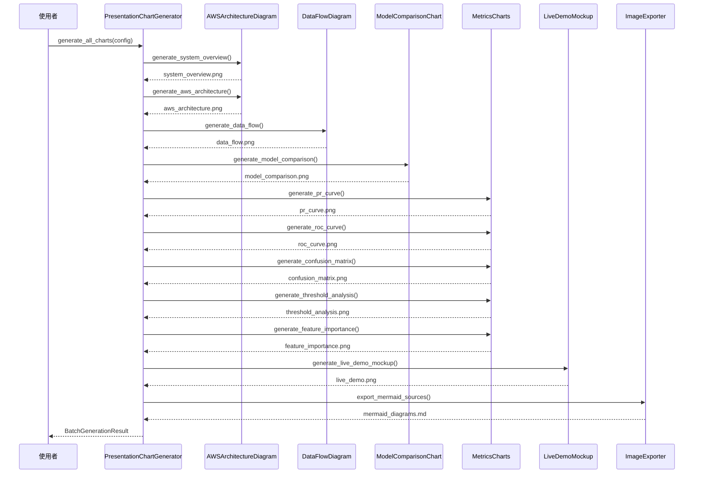
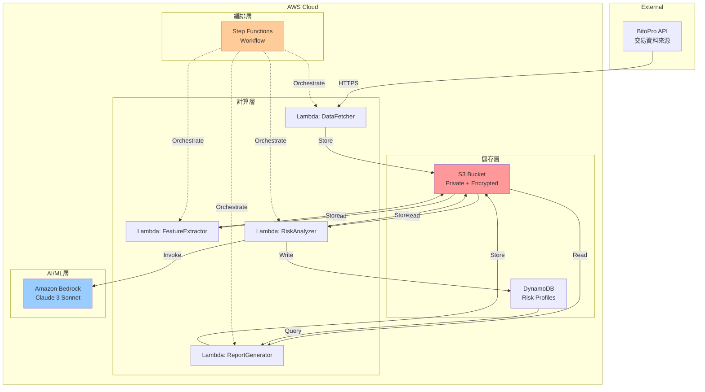
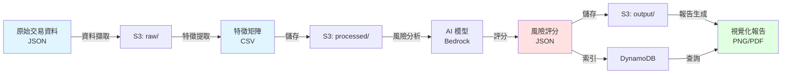

# 設計文件：簡報圖表生成系統

## 概述

為 3/26 加密貨幣可疑帳號偵測比賽提供專業的簡報圖表生成系統。本系統基於現有的 `model_evaluation_viz` 模組，擴展支援 AWS 架構圖、系統流程圖、模型比較圖表、以及 Live Demo 模擬介面等 10 種簡報用圖表。所有圖表採用統一的 AWS/FinTech 風格，適合 16:9 簡報格式，支援 Mermaid 與 PNG 雙格式輸出。

## 主要演算法/工作流程



## 核心介面/型別

```python
from dataclasses import dataclass
from typing import Dict, List, Optional
from matplotlib.figure import Figure

@dataclass
class PresentationConfig:
    """簡報圖表配置"""
    output_dir: str = "presentation_charts"
    aspect_ratio: tuple = (16, 9)  # 16:9 簡報格式
    dpi: int = 300  # 高解析度
    style: str = "aws_fintech"  # AWS/FinTech 風格
    color_scheme: str = "professional_blue"
    font_family: str = "Arial"
    title_font_size: int = 18
    label_font_size: int = 14
    export_mermaid: bool = True
    export_png: bool = True

@dataclass
class ChartMetadata:
    """圖表元資料"""
    chart_type: str
    title: str
    description: str
    filepath: str
    mermaid_source: Optional[str] = None
    timestamp: str = ""

@dataclass
class BatchGenerationResult:
    """批次生成結果"""
    generated_charts: Dict[str, ChartMetadata]
    failed_charts: Dict[str, str]
    output_directory: str
    timestamp: str
    mermaid_file: Optional[str] = None
```


## 關鍵函數與形式化規格

### 函數 1: generate_all_charts()

```python
def generate_all_charts(
    config: PresentationConfig,
    model_data: Optional[Dict] = None
) -> BatchGenerationResult
```

**前置條件：**
- `config` 是有效的 PresentationConfig 物件
- `config.output_dir` 是可寫入的目錄路徑
- `model_data` 若提供，必須包含 `y_true`, `y_pred`, `y_proba` 鍵值

**後置條件：**
- 返回 BatchGenerationResult 物件
- 所有成功生成的圖表檔案存在於 `config.output_dir`
- 若 `config.export_mermaid` 為 true，則生成 mermaid_diagrams.md
- 失敗的圖表記錄在 `failed_charts` 中

**迴圈不變式：** N/A（無迴圈）

### 函數 2: generate_system_overview()

```python
def generate_system_overview(config: PresentationConfig) -> Figure
```

**前置條件：**
- `config` 是有效的 PresentationConfig 物件

**後置條件：**
- 返回包含系統概覽架構圖的 Figure 物件
- 圖表尺寸符合 `config.aspect_ratio`
- 圖表包含：BitoPro API、Lambda Functions、S3、DynamoDB、Bedrock 等元件

**迴圈不變式：** N/A

### 函數 3: generate_aws_architecture()

```python
def generate_aws_architecture(config: PresentationConfig) -> Figure
```

**前置條件：**
- `config` 是有效的 PresentationConfig 物件

**後置條件：**
- 返回包含詳細 AWS 架構圖的 Figure 物件
- 圖表包含所有 AWS 服務：Lambda、S3、DynamoDB、Step Functions、Bedrock、Secrets Manager、CloudWatch
- 圖表標示資料流向與安全邊界

**迴圈不變式：** N/A

## 演算法偽程式碼

### 主要處理演算法

```pascal
ALGORITHM generateAllPresentationCharts(config, modelData)
INPUT: config of type PresentationConfig, modelData of type Optional[Dict]
OUTPUT: result of type BatchGenerationResult

BEGIN
  ASSERT config.output_dir is writable
  ASSERT config.aspect_ratio = (16, 9)
  
  // 步驟 1: 初始化輸出目錄
  createDirectory(config.output_dir)
  result ← initializeBatchResult()
  
  // 步驟 2: 生成架構圖表（不需要模型資料）
  chartGenerators ← [
    ("system_overview", generateSystemOverview),
    ("aws_architecture", generateAWSArchitecture),
    ("data_flow", generateDataFlow)
  ]
  
  FOR each (chartType, generator) IN chartGenerators DO
    TRY
      fig ← generator(config)
      filepath ← exportChart(fig, chartType, config)
      mermaidSource ← extractMermaidSource(chartType)
      
      metadata ← ChartMetadata(
        chart_type=chartType,
        filepath=filepath,
        mermaid_source=mermaidSource
      )
      result.generated_charts[chartType] ← metadata
    CATCH error
      result.failed_charts[chartType] ← error.message
    END TRY
  END FOR
  
  // 步驟 3: 生成模型評估圖表（需要模型資料）
  IF modelData IS NOT NULL THEN
    ASSERT "y_true" IN modelData
    ASSERT "y_pred" IN modelData
    ASSERT "y_proba" IN modelData
    
    metricsGenerators ← [
      ("model_comparison", generateModelComparison),
      ("pr_curve", generatePRCurve),
      ("roc_curve", generateROCCurve),
      ("confusion_matrix", generateConfusionMatrix),
      ("threshold_analysis", generateThresholdAnalysis),
      ("feature_importance", generateFeatureImportance)
    ]
    
    FOR each (chartType, generator) IN metricsGenerators DO
      TRY
        fig ← generator(config, modelData)
        filepath ← exportChart(fig, chartType, config)
        
        metadata ← ChartMetadata(
          chart_type=chartType,
          filepath=filepath
        )
        result.generated_charts[chartType] ← metadata
      CATCH error
        result.failed_charts[chartType] ← error.message
      END TRY
    END FOR
  END IF
  
  // 步驟 4: 生成 Live Demo 模擬介面
  TRY
    fig ← generateLiveDemoMockup(config)
    filepath ← exportChart(fig, "live_demo", config)
    result.generated_charts["live_demo"] ← ChartMetadata(
      chart_type="live_demo",
      filepath=filepath
    )
  CATCH error
    result.failed_charts["live_demo"] ← error.message
  END TRY
  
  // 步驟 5: 匯出 Mermaid 原始碼
  IF config.export_mermaid THEN
    mermaidFile ← exportAllMermaidSources(result, config)
    result.mermaid_file ← mermaidFile
  END IF
  
  ASSERT result.generated_charts.size() > 0
  
  RETURN result
END
```


### 架構圖生成演算法

```pascal
ALGORITHM generateAWSArchitecture(config)
INPUT: config of type PresentationConfig
OUTPUT: fig of type Figure

BEGIN
  // 建立畫布
  fig, ax ← createFigure(
    figsize=(16, 9),
    dpi=config.dpi
  )
  
  // 定義 AWS 服務元件位置
  components ← {
    "BitoPro API": (0.1, 0.9),
    "Secrets Manager": (0.2, 0.8),
    "Step Functions": (0.5, 0.9),
    "Lambda DataFetcher": (0.3, 0.7),
    "Lambda FeatureExtractor": (0.4, 0.6),
    "Lambda RiskAnalyzer": (0.5, 0.5),
    "Lambda ReportGenerator": (0.6, 0.4),
    "S3 Bucket": (0.7, 0.6),
    "DynamoDB": (0.8, 0.5),
    "Bedrock": (0.6, 0.3),
    "CloudWatch": (0.9, 0.7)
  }
  
  // 繪製元件方塊
  FOR each (name, position) IN components DO
    color ← getAWSServiceColor(name)
    drawRectangle(ax, position, name, color)
  END FOR
  
  // 繪製資料流箭頭
  connections ← [
    ("BitoPro API", "Lambda DataFetcher"),
    ("Secrets Manager", "Lambda DataFetcher"),
    ("Step Functions", "Lambda DataFetcher"),
    ("Lambda DataFetcher", "S3 Bucket"),
    ("S3 Bucket", "Lambda FeatureExtractor"),
    ("Lambda FeatureExtractor", "S3 Bucket"),
    ("S3 Bucket", "Lambda RiskAnalyzer"),
    ("Lambda RiskAnalyzer", "Bedrock"),
    ("Lambda RiskAnalyzer", "S3 Bucket"),
    ("Lambda RiskAnalyzer", "DynamoDB"),
    ("S3 Bucket", "Lambda ReportGenerator"),
    ("DynamoDB", "Lambda ReportGenerator"),
    ("Lambda ReportGenerator", "S3 Bucket")
  ]
  
  FOR each (source, target) IN connections DO
    drawArrow(ax, components[source], components[target])
  END FOR
  
  // 加入標題與圖例
  setTitle(ax, "AWS 架構圖 - 加密貨幣可疑帳號偵測系統", config)
  addLegend(ax, ["計算層", "儲存層", "AI/ML層", "監控層"])
  
  RETURN fig
END
```

### 資料流程圖生成演算法

```pascal
ALGORITHM generateDataFlow(config)
INPUT: config of type PresentationConfig
OUTPUT: fig of type Figure

BEGIN
  fig, ax ← createFigure(
    figsize=(16, 9),
    dpi=config.dpi
  )
  
  // 定義資料流程階段
  stages ← [
    {name: "資料擷取", icon: "download", color: "#3498db"},
    {name: "特徵提取", icon: "cogs", color: "#2ecc71"},
    {name: "風險分析", icon: "brain", color: "#e74c3c"},
    {name: "報告生成", icon: "chart", color: "#f39c12"}
  ]
  
  // 繪製流程階段
  x ← 0.1
  FOR each stage IN stages DO
    drawFlowStage(ax, x, 0.5, stage.name, stage.color)
    
    IF stage IS NOT last THEN
      drawFlowArrow(ax, x + 0.15, 0.5, x + 0.25, 0.5)
    END IF
    
    x ← x + 0.2
  END FOR
  
  // 加入資料格式標註
  dataFormats ← [
    "JSON (原始交易)",
    "CSV (特徵矩陣)",
    "JSON (風險評分)",
    "PNG/PDF (報告)"
  ]
  
  FOR i FROM 0 TO dataFormats.length - 1 DO
    addAnnotation(ax, 0.1 + i * 0.2, 0.3, dataFormats[i])
  END FOR
  
  setTitle(ax, "資料流程圖", config)
  
  RETURN fig
END
```


## 範例使用

```python
# 範例 1: 生成所有簡報圖表（不含模型資料）
from src.presentation_charts import PresentationChartGenerator, PresentationConfig

config = PresentationConfig(
    output_dir="presentation_charts",
    aspect_ratio=(16, 9),
    dpi=300,
    style="aws_fintech",
    export_mermaid=True,
    export_png=True
)

generator = PresentationChartGenerator(config)
result = generator.generate_all_charts()

print(f"成功生成 {len(result.generated_charts)} 張圖表")
print(f"失敗 {len(result.failed_charts)} 張圖表")

# 範例 2: 生成包含模型評估的完整圖表集
import numpy as np

# 準備模型資料
model_data = {
    "y_true": np.array([0, 1, 1, 0, 1, 0, 1, 0]),
    "y_pred": np.array([0, 1, 0, 0, 1, 1, 1, 0]),
    "y_proba": np.array([0.1, 0.9, 0.8, 0.2, 0.85, 0.6, 0.75, 0.15]),
    "feature_names": ["交易頻率", "金額變異", "時間模式", "地理分布"],
    "feature_importance": np.array([0.35, 0.28, 0.22, 0.15]),
    "models_comparison": {
        "XGBoost": {
            "Accuracy": 0.8700,
            "Precision": 0.8500,
            "Recall": 0.8900,
            "F1 Score": 0.8700,
            "AUC": 0.9200
        },
        "Random Forest": {
            "Accuracy": 0.8500,
            "Precision": 0.8200,
            "Recall": 0.8800,
            "F1 Score": 0.8500,
            "AUC": 0.9000
        }
    }
}

result = generator.generate_all_charts(model_data=model_data)

# 範例 3: 單獨生成特定圖表
fig = generator.generate_aws_architecture()
generator.export_chart(fig, "aws_architecture_custom.png")

# 範例 4: 生成 Live Demo 模擬介面
demo_fig = generator.generate_live_demo_mockup(
    sample_accounts=[
        {"id": "ACC001", "risk_score": 85, "level": "CRITICAL"},
        {"id": "ACC002", "risk_score": 45, "level": "MEDIUM"},
        {"id": "ACC003", "risk_score": 15, "level": "LOW"}
    ]
)
```

## 正確性屬性

*屬性是一種特徵或行為，應該在系統的所有有效執行中保持為真——本質上是關於系統應該做什麼的形式化陳述。屬性作為人類可讀規格與機器可驗證正確性保證之間的橋樑。*

### 屬性 1: 架構圖表生成完整性

*對於任何*不包含模型資料的批次生成請求，應該生成且僅生成系統概覽圖、AWS 架構圖、資料流程圖三張架構圖表

**驗證需求：需求 1.1**

### 屬性 2: 模型評估圖表生成完整性

*對於任何*包含有效模型資料的批次生成請求，除了架構圖表外，應該額外生成模型比較圖、PR 曲線、ROC 曲線、混淆矩陣、閾值分析圖、特徵重要性圖六張評估圖表

**驗證需求：需求 1.2**

### 屬性 3: 錯誤隔離性

*對於任何*批次生成過程，若某張圖表生成失敗，該失敗應被記錄在 failed_charts 中，且不應阻止其他圖表的生成

**驗證需求：需求 1.3, 12.3**

### 屬性 4: 結果完整性

*對於任何*批次生成結果，所有成功生成的圖表應包含完整的元資料，所有失敗的圖表應包含錯誤訊息，且成功與失敗的圖表集合應互斥

**驗證需求：需求 1.4**

### 屬性 5: Mermaid 匯出一致性

*對於任何*啟用 Mermaid 匯出的配置，所有架構圖表（系統概覽圖、AWS 架構圖、資料流程圖）的 Mermaid 原始碼應被匯出至單一 Markdown 檔案

**驗證需求：需求 2.4, 3.4, 4.4, 11.2**

### 屬性 6: 圖表格式一致性

*對於任何*生成的圖表，其寬高比應為 16:9，解析度應為 300 DPI，字型應為 Arial，標題字型大小應為 18，標籤字型大小應為 14

**驗證需求：需求 10.1, 10.2, 10.4**

### 屬性 7: 視覺風格一致性

*對於任何*兩張生成的圖表，它們應使用相同的色彩配置與風格設定

**驗證需求：需求 10.3**

### 屬性 8: 檔案存在性

*對於任何*成功生成的圖表，其對應的檔案應存在於配置指定的輸出目錄中，且檔案名稱應符合描述性命名規則

**驗證需求：需求 11.3, 11.4**

### 屬性 9: 輸出目錄自動建立

*對於任何*不存在的輸出目錄，系統應自動建立該目錄

**驗證需求：需求 11.5**

### 屬性 10: 模型比較圖指標完整性

*對於任何*模型比較圖，應顯示 Accuracy、Precision、Recall、F1 Score、AUC 五項指標

**驗證需求：需求 5.2**

### 屬性 11: 模型比較圖色彩區分

*對於任何*包含多個模型的模型比較圖，每個模型應使用不同的顏色

**驗證需求：需求 5.3**

### 屬性 12: PR 曲線標註完整性

*對於任何*PR 曲線圖，應標示 AUC-PR 數值

**驗證需求：需求 6.3**

### 屬性 13: ROC 曲線標註完整性

*對於任何*ROC 曲線圖，應標示 AUC-ROC 數值與對角線基準線

**驗證需求：需求 6.4**

### 屬性 14: 混淆矩陣完整性

*對於任何*混淆矩陣，應顯示 True Positive、True Negative、False Positive、False Negative 四個數值

**驗證需求：需求 7.2**

### 屬性 15: 混淆矩陣色彩映射

*對於任何*混淆矩陣，數值較大的格子應使用較深的顏色

**驗證需求：需求 7.3**

### 屬性 16: 閾值分析圖曲線完整性

*對於任何*閾值分析圖，應顯示 Precision、Recall、F1 Score 三條曲線

**驗證需求：需求 8.2**

### 屬性 17: 閾值分析圖最佳點標註

*對於任何*閾值分析圖，應標示最佳 F1 Score 對應的閾值點

**驗證需求：需求 8.3**

### 屬性 18: 閾值分析圖軸配置

*對於任何*閾值分析圖，X 軸應表示閾值範圍（0.0 到 1.0），Y 軸應表示指標數值

**驗證需求：需求 8.4**

### 屬性 19: 特徵重要性排序

*對於任何*特徵重要性圖，特徵應按重要性數值由高到低排序

**驗證需求：需求 9.2**

### 屬性 20: 特徵重要性百分比顯示

*對於任何*特徵重要性圖，每個特徵應顯示其重要性百分比

**驗證需求：需求 9.3**

### 屬性 21: 特徵重要性截斷

*對於任何*包含超過 20 個特徵的特徵重要性資料，圖表應僅顯示前 20 個最重要的特徵

**驗證需求：需求 9.4**

### 屬性 22: 陣列長度一致性驗證

*對於任何*提供的模型資料，y_true、y_pred、y_proba 陣列的長度應一致，否則應拋出 ValidationError

**驗證需求：需求 13.2**

### 屬性 23: 機率值範圍驗證

*對於任何*提供的 y_proba 資料，所有數值應在 0.0 到 1.0 範圍內，否則應拋出 ValidationError

**驗證需求：需求 13.3**

### 屬性 24: 路徑遍歷防護

*對於任何*提供的 PresentationConfig，若 output_dir 包含路徑遍歷字元（如 ../），應拋出驗證錯誤

**驗證需求：需求 13.1**

### 屬性 25: 特徵名稱長度限制

*對於任何*提供的特徵名稱，其長度應不超過 100 個字元，否則應拋出驗證錯誤

**驗證需求：需求 13.4**

### 屬性 26: 記憶體釋放

*對於任何*生成並匯出的圖表，其 Figure 物件應在匯出後立即被關閉以釋放記憶體

**驗證需求：需求 14.3**

### 屬性 27: 檔案大小限制

*對於任何*匯出的 PNG 圖表，其檔案大小應不超過 500 KB

**驗證需求：需求 14.4**

### 屬性 28: Mermaid 匯出失敗隔離

*對於任何*Mermaid 匯出失敗的情況，應記錄警告訊息但不應影響 PNG 圖表的生成

**驗證需求：需求 12.4**


## 錯誤處理

### 錯誤場景 1: 輸出目錄無法寫入

**條件：** `config.output_dir` 不存在且無法建立，或無寫入權限
**回應：** 拋出 `IOError` 並記錄錯誤訊息
**復原：** 提示使用者檢查目錄權限或使用預設目錄

### 錯誤場景 2: 模型資料格式錯誤

**條件：** `model_data` 缺少必要鍵值（`y_true`, `y_pred`, `y_proba`）或資料型別不正確
**回應：** 拋出 `ValidationError` 並記錄具體缺少的欄位
**復原：** 跳過模型評估圖表生成，僅生成架構圖表

### 錯誤場景 3: 圖表生成失敗

**條件：** 單一圖表生成過程中發生異常（如記憶體不足、繪圖錯誤）
**回應：** 捕捉異常，記錄在 `result.failed_charts` 中，繼續生成其他圖表
**復原：** 批次生成不中斷，最終報告中標示失敗的圖表

### 錯誤場景 4: Mermaid 匯出失敗

**條件：** Mermaid 原始碼檔案無法寫入
**回應：** 記錄警告訊息，但不影響 PNG 圖表生成
**復原：** 使用者可手動從程式碼中提取 Mermaid 原始碼

## 測試策略

### 單元測試方法

- 測試每個圖表生成函數的獨立功能
- 驗證圖表尺寸、DPI、色彩配置是否符合規格
- 測試錯誤處理邏輯（無效輸入、缺少資料）
- 使用 mock 物件模擬檔案系統操作

**關鍵測試案例：**
1. `test_generate_system_overview_dimensions()` - 驗證圖表尺寸
2. `test_generate_aws_architecture_components()` - 驗證所有 AWS 元件存在
3. `test_batch_generation_with_partial_failure()` - 驗證部分失敗不影響其他圖表
4. `test_mermaid_export_content()` - 驗證 Mermaid 原始碼完整性

### 屬性測試方法

**屬性測試函式庫：** Hypothesis

使用 Hypothesis 生成隨機配置與模型資料，驗證系統在各種輸入下的穩健性。

**關鍵屬性測試：**
1. 圖表尺寸一致性屬性（屬性 1）
2. 檔案完整性屬性（屬性 2）
3. 色彩一致性屬性（屬性 5）

### 整合測試方法

- 測試完整的批次生成流程
- 驗證生成的檔案可被其他工具讀取（如 PowerPoint、PDF 轉換器）
- 測試與現有 `model_evaluation_viz` 模組的整合
- 驗證 Mermaid 原始碼可被 Mermaid Live Editor 正確渲染

## 效能考量

### 記憶體優化
- 每次生成圖表後立即釋放 Figure 物件
- 使用串流方式寫入大型 Mermaid 檔案
- 限制同時開啟的圖表數量

### 生成速度
- 架構圖表生成：< 2 秒/張
- 模型評估圖表生成：< 5 秒/張（依賴現有 `model_evaluation_viz` 模組）
- 完整批次生成（10 張圖表）：< 30 秒

### 檔案大小
- PNG 圖表：< 500 KB/張（300 DPI）
- Mermaid 原始碼檔案：< 50 KB

## 安全考量

### 資料隱私
- 不在圖表中顯示真實的 API 金鑰或敏感資訊
- Live Demo 模擬介面使用假資料
- 確保輸出目錄權限設定正確

### 輸入驗證
- 驗證 `config.output_dir` 路徑不包含路徑遍歷攻擊（如 `../`）
- 驗證模型資料陣列長度一致性
- 限制圖表標題與標籤長度，防止記憶體溢位

## 依賴項目

### Python 套件
- `matplotlib >= 3.7.0` - 圖表繪製
- `numpy >= 1.24.0` - 數值計算
- `Pillow >= 10.0.0` - 圖片處理
- `pyyaml >= 6.0` - 配置檔案解析

### 內部模組
- `src.model_evaluation_viz.core.chart_generator` - 模型評估圖表生成
- `src.model_evaluation_viz.styling.chart_styler` - 圖表樣式管理
- `src.model_evaluation_viz.export.image_exporter` - 圖片匯出

### 外部工具（可選）
- Mermaid Live Editor - 驗證 Mermaid 原始碼
- PowerPoint - 驗證圖表可嵌入簡報

## Mermaid 圖表原始碼範例

### System Overview Diagram



### Data Flow Diagram



