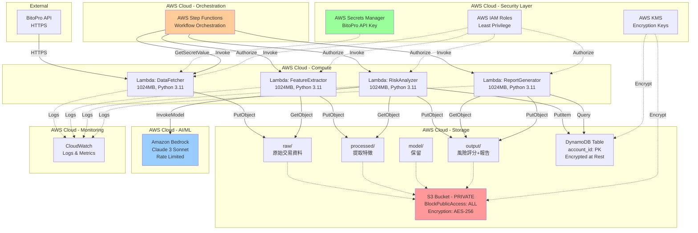
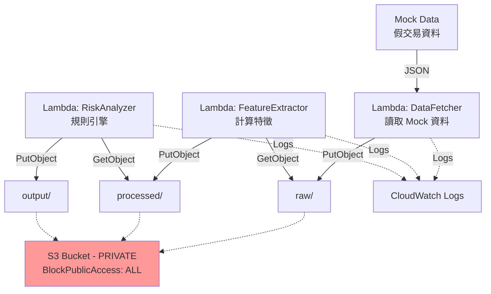

# AWS 架構設計 - 加密貨幣可疑帳號偵測系統

## 架構概覽

本系統採用 AWS 無伺服器架構，完全符合黑客松比賽規範，所有資源皆為私有且加密。

## 核心元件

### 計算層
- **AWS Lambda** (4 個函數)
  - DataFetcher: 從 BitoPro API 獲取交易資料
  - FeatureExtractor: 提取風險特徵
  - RiskAnalyzer: AI 驅動的風險評估
  - ReportGenerator: 產生報告與視覺化

### 編排層
- **AWS Step Functions**: 協調 Lambda 函數執行順序

### 儲存層
- **Amazon S3** (Private Bucket)
  - `raw/`: 原始交易資料
  - `processed/`: 提取的特徵
  - `model/`: 保留給未來模型檔案
  - `output/`: 風險評分與報告

- **Amazon DynamoDB**: 帳號風險檔案（快速查詢）

### AI/ML 層
- **Amazon Bedrock**: Claude 3 Sonnet 模型（Rate Limited < 1 req/sec）

### 安全層
- **AWS Secrets Manager**: BitoPro API 金鑰
- **AWS IAM**: 最小權限角色
- **AWS KMS**: 加密金鑰管理

### 監控層
- **Amazon CloudWatch**: 日誌與指標

## 資料流

```
BitoPro API → DataFetcher → S3 raw/
                ↓
         FeatureExtractor → S3 processed/
                ↓
          RiskAnalyzer → Bedrock (AI) → S3 output/ + DynamoDB
                ↓
        ReportGenerator → S3 output/ (報告+圖表)
```

## 合規檢查清單

✅ S3 Bucket 完全私有 (BlockPublicAccess: ALL)
✅ S3 與 DynamoDB 加密 (AES-256)
✅ 無公開 EC2/RDS/EMR
✅ Bedrock Rate Limit < 1 req/sec
✅ Secrets 存放於 Secrets Manager
✅ IAM 最小權限原則
✅ CloudWatch 不記錄敏感資訊
✅ 保留 .kiro/ 目錄於 GitHub

## 詳細架構圖

請參考下方 Mermaid 圖表。


## 完整架構圖 (Mermaid)




## 4 小時最小版本架構

為了在 4 小時內完成 MVP，建議簡化架構：

### 簡化策略
1. **跳過 DynamoDB**: 只使用 S3 儲存
2. **跳過圖表**: 只產生 JSON 報告
3. **Mock BitoPro API**: 使用假資料測試
4. **規則引擎 Only**: 跳過 Bedrock，直接使用 fallback 規則
5. **手動觸發**: 直接呼叫 Lambda，不使用 Step Functions

### 最小版本架構圖



## 安全設計重點

### S3 Bucket 設定
```yaml
PublicAccessBlockConfiguration:
  BlockPublicAcls: true
  BlockPublicPolicy: true
  IgnorePublicAcls: true
  RestrictPublicBuckets: true

BucketEncryption:
  ServerSideEncryptionConfiguration:
    - ServerSideEncryptionByDefault:
        SSEAlgorithm: AES256
```

### IAM 最小權限範例
```json
{
  "Version": "2012-10-17",
  "Statement": [
    {
      "Effect": "Allow",
      "Action": ["s3:GetObject"],
      "Resource": ["arn:aws:s3:::bucket-name/raw/*"]
    },
    {
      "Effect": "Allow",
      "Action": ["s3:PutObject"],
      "Resource": ["arn:aws:s3:::bucket-name/processed/*"]
    }
  ]
}
```

### Bedrock Rate Limiter
```python
import time

class RateLimiter:
    def __init__(self, max_rps=0.9):
        self.min_interval = 1.0 / max_rps
        self.last_request_time = 0.0
    
    def wait_if_needed(self):
        elapsed = time.time() - self.last_request_time
        if elapsed < self.min_interval:
            time.sleep(self.min_interval - elapsed)
        self.last_request_time = time.time()
```


## 容易違規的地方 ⚠️

### 1. S3 Bucket 公開存取
- ❌ **錯誤**: 忘記設定 BlockPublicAccess
- ✅ **正確**: 在 SAM template 明確設定所有 Block 為 true

### 2. Bedrock Rate Limit 超標
- ❌ **錯誤**: 並行呼叫 Bedrock 或忘記 sleep
- ✅ **正確**: 使用 RateLimiter class，確保 < 1 req/sec

### 3. Secrets 硬編碼
- ❌ **錯誤**: API Key 寫在程式碼或環境變數
- ✅ **正確**: 使用 Secrets Manager + IAM Role

### 4. CloudWatch 記錄敏感資訊
- ❌ **錯誤**: `log.info(f"API Key: {api_key}")`
- ✅ **正確**: `log.info("API Key retrieved successfully")`

### 5. EC2 Security Group 0.0.0.0/0
- ❌ **錯誤**: 若使用 EC2，開放所有 IP
- ✅ **正確**: 本架構不使用 EC2，全部使用 Lambda

### 6. RDS/EMR 公開存取
- ❌ **錯誤**: PubliclyAccessible: true
- ✅ **正確**: 本架構不使用 RDS/EMR

### 7. GitHub 提交 secrets
- ❌ **錯誤**: .env 檔案包含 API Key
- ✅ **正確**: .gitignore 排除所有 secrets

### 8. 忘記保留 .kiro 目錄
- ❌ **錯誤**: .gitignore 排除 .kiro/
- ✅ **正確**: 確保 .kiro/ 目錄提交至 GitHub

## 部署步驟

1. **安裝 AWS SAM CLI**
   ```bash
   pip install aws-sam-cli
   ```

2. **設定 AWS Credentials**
   ```bash
   aws configure
   ```

3. **建立 Secrets Manager Entry**
   ```bash
   aws secretsmanager create-secret \
     --name bitopro-api-key \
     --secret-string '{"api_key":"YOUR_API_KEY","api_secret":"YOUR_SECRET"}'
   ```

4. **部署架構**
   ```bash
   cd infrastructure
   sam build
   sam deploy --guided
   ```

5. **驗證部署**
   ```bash
   ./verify-deployment.sh
   ```

## 成本估算（每次執行）

- Lambda: ~$0.10 (100 帳號, 5 分鐘)
- Bedrock: ~$0.50 (100 帳號 × $0.005)
- S3: ~$0.01 (儲存 + 請求)
- DynamoDB: ~$0.05 (100 寫入 + 讀取)
- Step Functions: ~$0.01
- **總計: ~$0.67 per execution**

## 效能指標

- 資料擷取: < 30 秒
- 特徵提取: < 10 秒 (1,000 筆交易)
- 風險分析: ~1.1 秒/帳號 (rate limited)
- 報告產生: < 20 秒
- **總計: < 5 分鐘 (100 帳號)**

## 參考資料

- [AWS SAM Documentation](https://docs.aws.amazon.com/serverless-application-model/)
- [Amazon Bedrock Documentation](https://docs.aws.amazon.com/bedrock/)
- [BitoPro API Documentation](https://github.com/bitoex/bitopro-offical-api-docs)
- [AWS Security Best Practices](https://docs.aws.amazon.com/security/)
